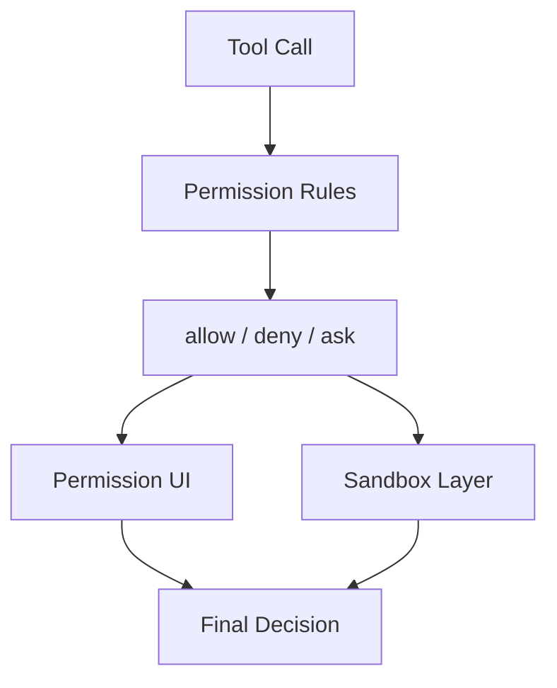

[简体中文](./README.md) | [English](./README.en.md)

# Permissions, Sandbox, And Trust In One Minute

Start with the shortest flow:

## Three Takeaways

- permission rules decide whether the tool call needs asking
- approval UI decides how the user answers
- sandboxing decides what the runtime can still do after approval

## Read Next

- overview: [README.en.md](../README.en.md)
- deep dive: [DEEP/README.en.md](../DEEP/README.en.md)
