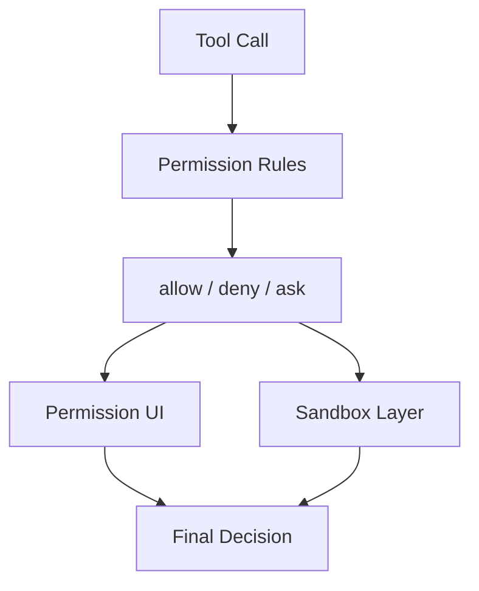

[简体中文](./README.md) | [English](./README.en.md)

# 1 分钟看懂 Permissions, Sandbox, And Trust

先看最短的流程：

## 三个要点

- permission rules 决定是否需要询问
- 审批 UI 决定用户如何回答
- sandbox 决定放行之后的运行范围

## 下一步去哪里

- 总览：[README.md](../README.md)
- 深读：[DEEP/README.md](../DEEP/README.md)
