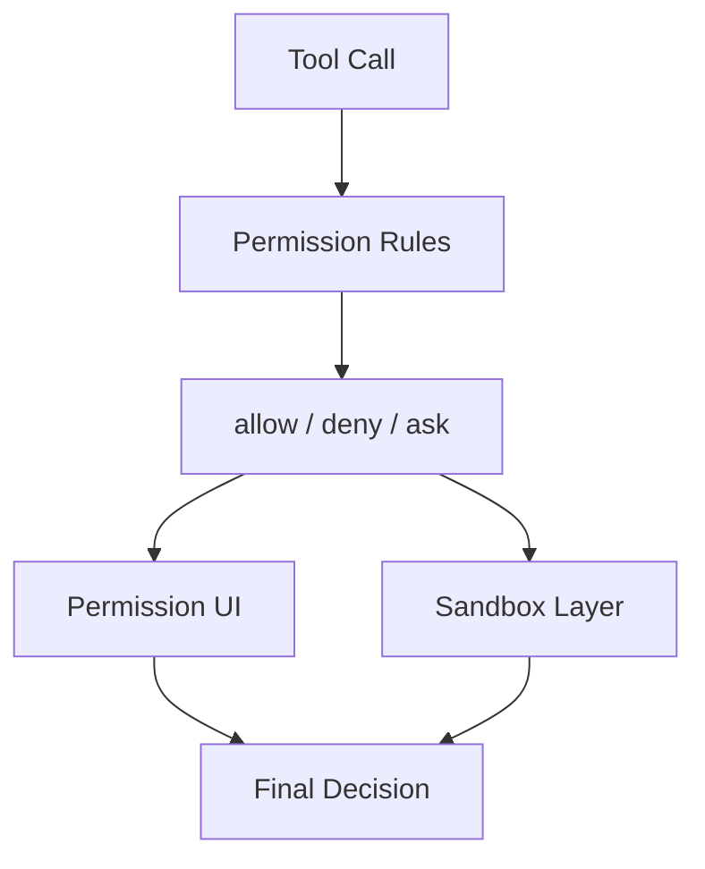

# 1 分钟看懂 Permissions, Sandbox, And Trust

先用一张图看：

如果你担心“它是不是能随便执行命令”，先看这一页最有帮助。

## 核心理解

- permission rule 决定“该不该问”
- 审批 UI 决定“用户怎么回答”
- sandbox 决定“就算放行了，运行时还能做多少”

## 下一步去哪里

- 想继续看规则层：读 `README.md`
- 想跟到源码：读 `DEEP/README.md`
