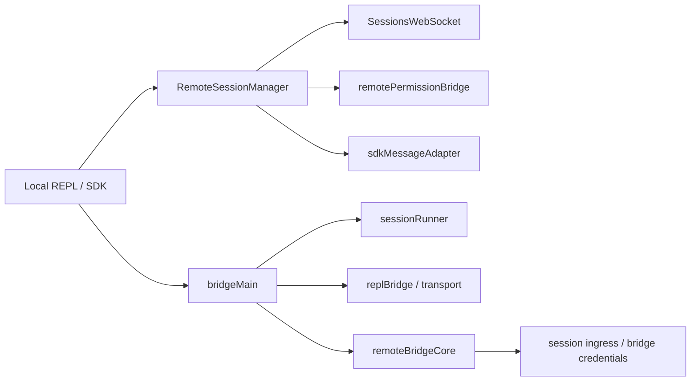

# 深度拆解：Remote Session, Bridge, And SDK

这一章要回答的核心问题是：**Claude Code 的远程会话和 bridge 到底是不是一层独立运行时。**

公开镜像给出的答案相当明确：**是。**

而且这里至少可以分成两层：

- `remote/` 负责 remote session 对象与消息适配
- `bridge/` 负责 bridge loop、transport、session runner、认证与桥接协议

## 这部分负责什么

这部分主要负责：

1. 建立远程会话
2. 收发 SDK 消息和 control request
3. 桥接本地 REPL 与远程 ingress / worker transport
4. 处理远程 permission request 与 reconnect

## 关键文件

- `restored-src/src/remote/RemoteSessionManager.ts`
- `restored-src/src/remote/SessionsWebSocket.ts`
- `restored-src/src/remote/remotePermissionBridge.ts`
- `restored-src/src/remote/sdkMessageAdapter.ts`
- `restored-src/src/bridge/bridgeMain.ts`
- `restored-src/src/bridge/remoteBridgeCore.ts`
- `restored-src/src/bridge/replBridge.ts`
- `restored-src/src/bridge/replBridgeTransport.ts`
- `restored-src/src/bridge/sessionRunner.ts`
- `restored-src/src/bridge/bridgePermissionCallbacks.ts`

## 执行流

### 1. `RemoteSessionManager` 负责会话对象

`restored-src/src/remote/RemoteSessionManager.ts` 的注释已经把职责写得很清楚：

- WebSocket 订阅远程消息
- HTTP POST 发送用户消息
- 管理 permission request / response 流

从实现还能直接确认：

- 它维护 `pendingPermissionRequests`
- 会区分 SDK message、control request、control response、cancel request
- `connect()` 会创建 `SessionsWebSocket`
- `respondToPermissionRequest()` 负责回发远程权限结果

所以 `RemoteSessionManager` 不是一个网络小工具，而是远程会话对象本身。

### 2. `remote/` 负责“会话侧”适配

同一目录下还能看到：

- `SessionsWebSocket.ts`
- `remotePermissionBridge.ts`
- `sdkMessageAdapter.ts`

这很重要，因为它说明 remote 层至少同时处理：

- 连接
- 权限桥接
- SDK 消息格式适配

换句话说，`remote/` 更像“远程会话层”，而不是一个单一传输文件。

### 3. `bridgeMain.ts` 负责 bridge loop

`restored-src/src/bridge/bridgeMain.ts` 很大，而且文件前段已经能看出它管理的是完整 bridge loop：

- API client
- session spawner
- heartbeat
- reconnect
- multi-session spawn
- timeout / backoff
- worktree session

这说明 bridge 不是“把输入输出接一下”，而是完整的桥接运行时。

### 4. `remoteBridgeCore.ts` 负责 env-less remote control 核心

`restored-src/src/bridge/remoteBridgeCore.ts` 开头的注释尤其有价值。

它明确区分了：

- env-based path
- env-less bridge core
- v2 transport
- OAuth 到 worker JWT 的交换

而且源码注释直接给出了一条流程：

1. 创建 session
2. 获取 bridge credentials
3. 创建 transport
4. 启动 token refresh scheduler
5. 401 时重建 transport

这已经足够说明，bridge 是单独的一层协议与生命周期管理。

### 5. `sessionRunner.ts` / `replBridge.ts` 说明桥接并不只服务一个简单 REPL

虽然这一轮没有把 `bridge/` 所有文件都展开，但从文件命名和当前主干引用关系能确认：

- `sessionRunner.ts` 负责 session 生成与运行
- `replBridge.ts` / `replBridgeTransport.ts` 负责 REPL 侧桥接
- `bridgePermissionCallbacks.ts` 负责权限相关回调桥

这说明 bridge 的职责覆盖了：

- session 启动
- transport
- permission callback
- reconnect / refresh

## 一张图看 remote 与 bridge 的分层

## 为什么这个设计重要

这里最重要的一点是：remote session 和 bridge 不是某个 IDE 集成附属品，而是被单独建模成了会话与桥接层。

这会带来几个直接结果：

- 远程权限请求可以有独立的 request/response 流
- transport 出问题时可以单独 reconnect / refresh
- 本地 REPL 与远程 worker 之间不是一次性连接，而是持续会话

也正因为如此，Claude Code 才能往“本地会话 + 远程执行 + bridge 控制”的方向继续扩展。

## 推荐阅读顺序

1. `restored-src/src/remote/RemoteSessionManager.ts`
2. `restored-src/src/remote/SessionsWebSocket.ts`
3. `restored-src/src/remote/remotePermissionBridge.ts`
4. `restored-src/src/bridge/bridgeMain.ts`
5. `restored-src/src/bridge/remoteBridgeCore.ts`
6. `restored-src/src/bridge/replBridge.ts`
7. `restored-src/src/bridge/sessionRunner.ts`

## 仍待确认

- env-based path 与 env-less path 在公开构建中的默认启用条件
- bridge 在不同产品入口中的完整组合方式

当前更稳妥的写法，是确认“bridge 是独立运行时”，但不扩写成完整产品叙事。
