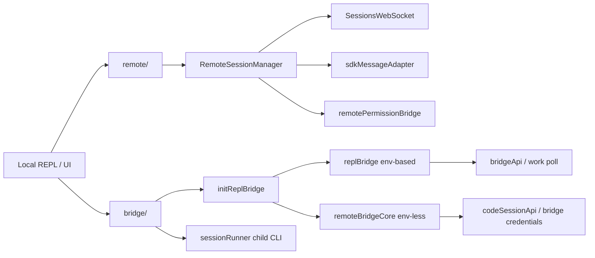

# 深度拆解：Remote Session, Bridge, And SDK

这一章要回答的核心问题是：

**Claude Code 的远程会话与 bridge，到底是不是一层独立运行时。**

公开镜像给出的答案是：**是。**

但这层运行时还要继续拆成两部分理解：

- `remote/`：附着到已有远端 session 的客户端层
- `bridge/`：把本地 REPL 或桥接子进程接到远端控制面的本地暴露层

## 这部分负责什么

这一层主要负责四件事：

1. 订阅远端 session、发送消息、处理权限往返
2. 把远端 `SDKMessage` 适配成本地 REPL / UI 可消费的消息
3. 把本地 REPL 或桥接子进程接到远端控制面
4. 处理 transport、重连、session 兼容和生命周期清理

## 关键文件

### 远端会话客户端层

- `restored-src/src/remote/RemoteSessionManager.ts`
- `restored-src/src/remote/SessionsWebSocket.ts`
- `restored-src/src/remote/sdkMessageAdapter.ts`
- `restored-src/src/remote/remotePermissionBridge.ts`

### 本地 bridge 暴露层

- `restored-src/src/bridge/initReplBridge.ts`
- `restored-src/src/bridge/replBridge.ts`
- `restored-src/src/bridge/remoteBridgeCore.ts`
- `restored-src/src/bridge/bridgeMain.ts`
- `restored-src/src/bridge/bridgeMessaging.ts`
- `restored-src/src/bridge/replBridgeTransport.ts`
- `restored-src/src/bridge/sessionRunner.ts`
- `restored-src/src/bridge/bridgeApi.ts`
- `restored-src/src/bridge/codeSessionApi.ts`
- `restored-src/src/bridge/workSecret.ts`
- `restored-src/src/bridge/sessionIdCompat.ts`

## 执行流

### 1. `remote/` 是“附着到已有 session 的客户端层”

这轮重新核读后，`remote/` 的边界可以写得更清楚：

- 它围绕已有 `sessionId` 建立连接
- 订阅远端消息
- 发送用户消息
- 处理远端权限请求 / 响应
- 把远端消息适配到本地 UI

`RemoteSessionManager.connect()` 会创建：

- `SessionsWebSocket`

然后把收到的消息路由到：

- 普通 SDK message
- `control_request`
- `control_response`
- `control_cancel_request`

其中：

- `can_use_tool` 类型的 `control_request` 会进入 `pendingPermissionRequests`
- 再交给本地 UI 做响应

这一层非常像：

- “远端会话客户端对象”

而不是：

- “本地 bridge loop”

### 2. `remote/` 不负责注册环境、轮询 work 或拉起本地子进程

这也是本轮最重要的边界之一。

当前复核能确认：

- `remote/` 不负责创建 bridge environment
- 不负责 `pollForWork`
- 不负责注册 worker
- 不负责启动本地 child CLI

这些职责都出现在：

- `bridge/`

所以文档里一定要把这两层拆开写。

### 3. `bridge/` 是本地 Remote Control 暴露层

`bridge/` 当前更准确的描述是：

- 通过出站 API / WS / SSE 把本地 REPL 或桥接子进程接到远端控制面

它负责的事情包括：

- 会话创建 / 恢复
- 环境注册
- work 轮询
- transport 建立
- 消息转发
- 控制请求处理
- 权限往返
- 生命周期清理

这里有一个需要直接写出来的保守结论：

- 在本轮复核范围里，没有看到 `createServer`、`listen()`、`WebSocketServer` 这类本地监听服务实现

所以不要把 `bridge/` 写成：

- “本地 HTTP 服务端”

### 4. `bridge/` 有两条路径：环境式与 env-less

当前源码里可以明确分成两条 bridge 路径。

#### 环境式路径

入口是：

- `initBridgeCore()`
- `runBridgeLoop()`

它会：

1. 调 `registerBridgeEnvironment()`
2. 轮询 `pollForWork`
3. 对 session work 做 `acknowledgeWork`
4. 根据 work secret 选择 v1 / v2 transport
5. 必要时把工作交给本地 child session

#### env-less 路径

入口是：

- `initEnvLessBridgeCore()`

它会：

1. 直接 `createCodeSession()`
2. 再调 `/bridge` 拿 `worker_jwt / api_base_url / worker_epoch`
3. 建立 v2 transport
4. 做 JWT 刷新与 transport 重建

所以这里不该写成：

- “只有一个 bridge core”

更准确的是：

- bridge 至少有环境式与 env-less 两种接法

### 5. transport 在客户端侧至少有 v1 / v2 两种形态

当前客户端代码显式支持两类 transport：

- v1：`HybridTransport`
  - WS 读 + Session-Ingress POST 写
- v2：`SSETransport + CCRClient`

这里需要保持保守措辞：

- 这些结论说明的是“客户端怎么连”
- 不是“服务端一定怎么实现”

### 6. `sessionRunner.ts` 说明 bridge 不只是一个内存态适配层

`sessionRunner.ts` 很关键，因为它说明 standalone / multi-session bridge 最终会：

- 拉起本地 `claude --print --sdk-url --session-id ...` 子进程
- 通过 stdin / stdout 做桥接

这也说明 `bridge/` 的职责不只是“转一下消息”，而是会管理真正的本地 worker 进程。

## 一张图看 `remote/` 与 `bridge/` 的分层

## 为什么这个设计重要

这里最重要的一点是：

- remote session 和 bridge 不是某个 IDE 集成附属品
- 而是被单独建模成了会话层与桥接层

这样带来的直接结果是：

- 远端权限请求可以有独立 request / response 流
- transport 出问题时可以单独做 reconnect / refresh
- 本地 REPL、远端 session、桥接子进程可以被拆开治理

## 推荐阅读顺序

1. `restored-src/src/remote/RemoteSessionManager.ts`
2. `restored-src/src/remote/SessionsWebSocket.ts`
3. `restored-src/src/remote/sdkMessageAdapter.ts`
4. `restored-src/src/bridge/initReplBridge.ts`
5. `restored-src/src/bridge/replBridge.ts`
6. `restored-src/src/bridge/remoteBridgeCore.ts`
7. `restored-src/src/bridge/replBridgeTransport.ts`
8. `restored-src/src/bridge/sessionRunner.ts`
9. `restored-src/src/bridge/bridgeMain.ts`

## 仍待确认

- `/bridge`、`worker_epoch`、`ccr_v2_compat_enabled` 等服务端语义，这一轮只能写成“客户端预期 / 兼容逻辑”，不能写成后端事实。
- `session_*` 与 `cse_*` 的双 ID 兼容逻辑可以确认存在，但服务端当前到底接受哪些 tag，不能只靠客户端静态代码写死。
- env-based 与 env-less 在真实产品入口里的默认启用条件，这一轮不继续外推。
