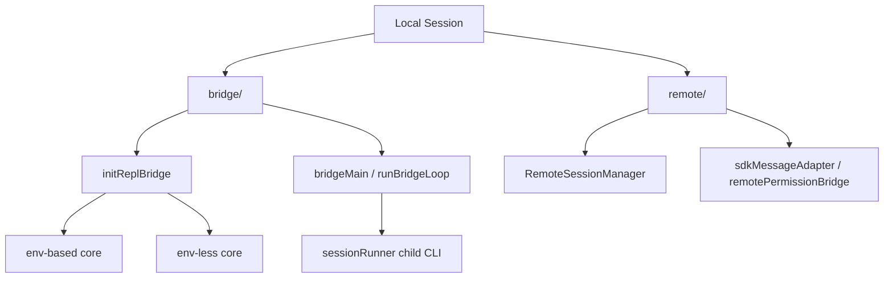

[简体中文](./README.md) | [English](./README.en.md)

# Remote Session, Bridge, And SDK In One Minute

Start by separating two names:

- `remote/`
- `bridge/`

## Three Takeaways

- `remote/` attaches to an existing remote session
- `bridge/` connects a local REPL or child CLI to remote control paths
- `bridge/` is safer to describe as a local bridge layer

## Read Next

- overview: [README.en.md](../README.en.md)
- deep dive: [DEEP/README.en.md](../DEEP/README.en.md)
