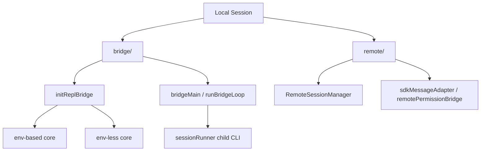

# 1 分钟看懂 Remote Session, Bridge, And SDK

先用一张图看：

```mermaid
flowchart TD
    A[Local Session] --> B[remote/]
    A --> C[bridge/]
    C --> D[initReplBridge]
    D --> E[env-based core]
    D --> F[env-less core]
    C --> G[bridgeMain / runBridgeLoop]
    G --> H[sessionRunner child CLI]
    B --> I[RemoteSessionManager]
    B --> J[sdkMessageAdapter / remotePermissionBridge]
```

## 核心理解

- 这不是只有“本地终端”这一种工作方式
- `remote/` 负责附着到已有远端 session
- `bridge/` 负责把本地 REPL 或 child CLI 接到远端控制面
- `bridge/` 当前更像本地桥接层，不像本地 HTTP 服务端
