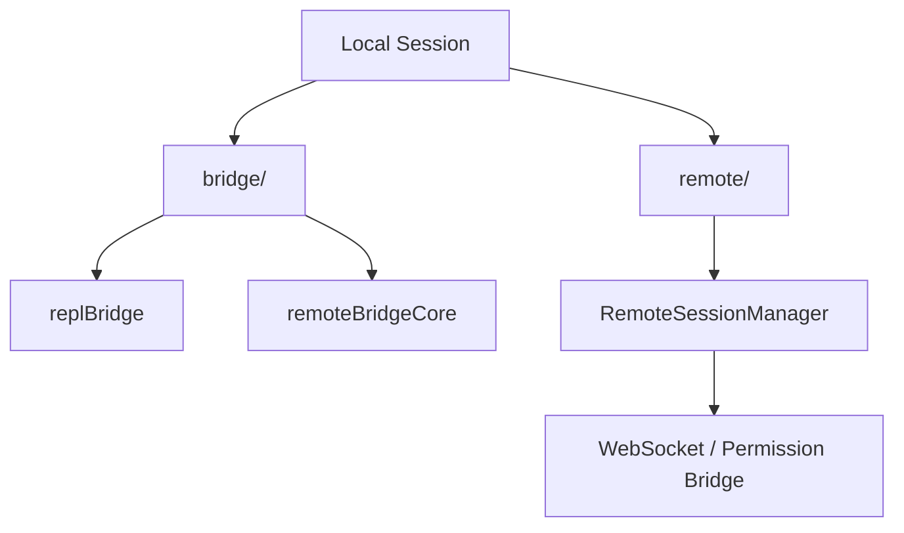

# 1 分钟看懂 Remote Session, Bridge, And SDK

先用一张图看：

```mermaid
flowchart TD
    A[Local Session] --> B[remote/]
    A --> C[bridge/]
    C --> D[replBridge]
    C --> E[remoteBridgeCore]
    B --> F[RemoteSessionManager]
    F --> G[WebSocket / Permission Bridge]
```

## 核心理解

- 这不是只有“本地终端”这一种工作方式
- `remote/` 说明会话本身可以被管理
- `bridge/` 说明 Claude Code 在处理跨界面、跨环境、跨 transport 的连接问题

