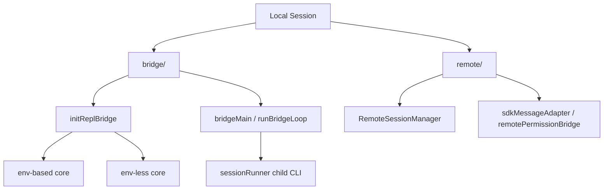

[简体中文](./README.md) | [English](./README.en.md)

# 1 分钟看懂 Remote Session, Bridge, And SDK

先分清两个名字：

- `remote/`
- `bridge/`

## 三个要点

- `remote/` 负责附着到已有远端 session
- `bridge/` 负责把本地 REPL 或 child CLI 接到远端控制链路
- `bridge/` 当前更适合写成本地桥接层

## 下一步去哪里

- 总览：[README.md](../README.md)
- 深读：[DEEP/README.md](../DEEP/README.md)
