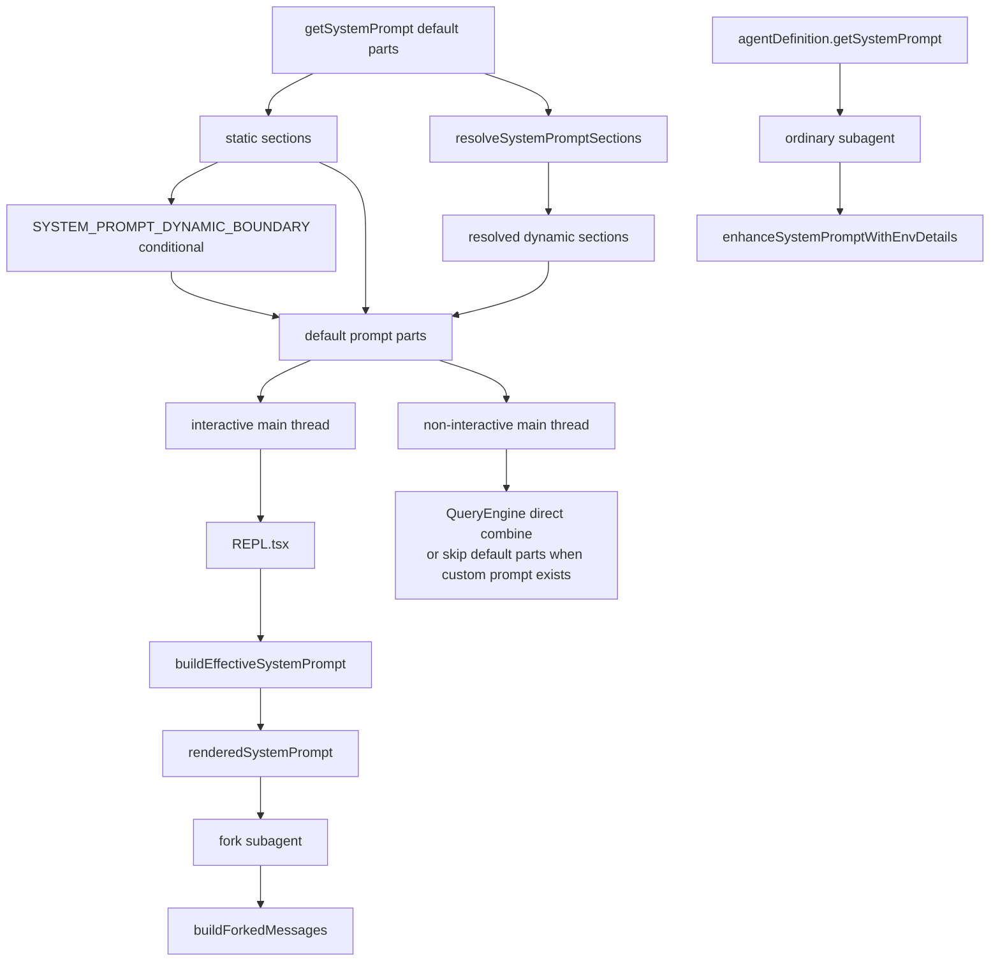

# 深度拆解：Prompts、Config 与系统装配层

这一章关注的不是“prompt 写得好不好”，而是：

**Claude Code 怎样把 prompt 当作运行时部件来装配。**

如果只看最终发给模型的文本，很容易忽略一个事实：在当前源码里，prompt 至少分成了几层：

- 默认 prompt parts 工厂
- section 缓存与 dynamic boundary
- interactive 主线程的最终 precedence
- non-interactive 主线程的另一条装配链
- 普通 subagent 与 fork subagent 的不同继承模型

## 这部分负责什么

这一层主要负责三件事：

1. 在 `constants/prompts.ts` 里生成 default prompt parts
2. 在 `constants/systemPromptSections.ts` 里管理 section cache 与 dynamic boundary
3. 在 `utils/systemPrompt.ts`、`QueryEngine.ts`、`AgentTool/runAgent.ts` 里把这些 parts 组装成不同会话类型真正使用的 prompt

## 关键文件

- `restored-src/src/main.tsx`
- `restored-src/src/constants/prompts.ts`
- `restored-src/src/constants/systemPromptSections.ts`
- `restored-src/src/utils/systemPrompt.ts`
- `restored-src/src/screens/REPL.tsx`
- `restored-src/src/utils/queryContext.ts`
- `restored-src/src/QueryEngine.ts`
- `restored-src/src/tools/AgentTool/AgentTool.tsx`
- `restored-src/src/tools/AgentTool/runAgent.ts`
- `restored-src/src/tools/AgentTool/forkSubagent.ts`

## 执行流

### 1. `getSystemPrompt()` 先生成 default prompt parts

`constants/prompts.ts` 里的 `getSystemPrompt()` 返回的不是单段最终文本，而是：

- default prompt parts

标准路径里，它会构造：

- 静态前缀
- 动态 sections

然后在满足全局缓存条件时，才会在两者之间插入：

- `SYSTEM_PROMPT_DYNAMIC_BOUNDARY`

这意味着默认主 prompt 在源码里已经被明确拆成：

- static
- dynamic

而不是一段后期再切的长文本。

这里还要多补一个边界：

- `SYSTEM_PROMPT_DYNAMIC_BOUNDARY` 是条件插入
- 只有 `shouldUseGlobalCacheScope()` 为真时才会出现

### 2. section cache 是独立层，不是内容层

`constants/systemPromptSections.ts` 提供的是：

- `systemPromptSection()`
- `DANGEROUS_uncachedSystemPromptSection()`
- `resolveSystemPromptSections()`
- `clearSystemPromptSections()`

这一层负责的不是“写 prompt 内容”，而是：

- 哪些 section 可缓存
- 哪些 section 每轮必须重算
- `/clear` / `/compact` 后如何失效

当前这轮可以更明确地写出：

- `mcp_instructions` 是标准路径里最明确的 uncached section
- 它不是抽象概念，而是通过 `DANGEROUS_uncachedSystemPromptSection(...)` 注册进去的

### 3. interactive 主线程会在 `REPL.tsx` 里再走一次 `buildEffectiveSystemPrompt()`

`utils/systemPrompt.ts` 负责 interactive 主线程的最终 precedence。

真正触发这一步的 interactive 装配点，更适合直接落在：

- `screens/REPL.tsx`

这里可以直接把一句旧说法改得更清楚：

- 交互式主线程不是先经过 `QueryEngine`
- 而是在 `REPL.tsx` 里先装好 prompt，再直接进入 `query()`
- 同一层还会从 store 现算工具池，并把 `refreshTools` 挂到 `toolUseContext`

当前可确认的优先级更适合写成：

1. `overrideSystemPrompt`
2. `coordinator prompt`（仅协调模式开启且没有 `mainThreadAgentDefinition` 时）
3. `mainThreadAgentDefinition`
4. `customSystemPrompt`
5. `defaultSystemPrompt`
6. `appendSystemPrompt`

其中：

- 只要不是 override
- `appendSystemPrompt` 都会尾追加

还有一个必须写明的分支：

- 平时 main-thread agent prompt 会替换 default
- proactive / KAIROS 激活时，main-thread agent prompt 会作为 `# Custom Agent Instructions` 追加在 default 后面

所以“main-thread agent 是否替换默认 prompt”本身也是运行时相关的。

### 4. non-interactive 主线程不是同一条 precedence

这一点很容易被旧文档写错。

`QueryEngine.ts` 的 non-interactive / SDK 路径不会走：

- `buildEffectiveSystemPrompt()`

它的组合方式是：

- `customSystemPrompt ?? defaultSystemPrompt`
- `+ memoryMechanicsPrompt?`
- `+ appendSystemPrompt`

同时，`queryContext.ts` 还能确认：

- 只要 `customSystemPrompt` 存在，就会跳过 `getSystemPrompt()` 和 `getSystemContext()`
- `memoryMechanicsPrompt` 也不是普遍存在，而是 `customSystemPrompt` 存在且 `hasAutoMemPathOverride()` 为真时才会追加

`main.tsx` 里还对 non-interactive custom main-thread agent 做了额外特判：

- 会直接把 custom main-thread agent 的 prompt 放进 headless `systemPrompt`

所以 interactive 与 non-interactive 不是“同一条 prompt 链换了个壳”，而是真有两条不同装配路径。

### 5. 普通 subagent 与 fork subagent 不共享同一条 prompt 模型

普通 subagent：

- 起点是 `agentDefinition.getSystemPrompt()`
- 若失败则回退到 `DEFAULT_AGENT_PROMPT`
- 再经过 `enhanceSystemPromptWithEnvDetails()`

fork subagent：

- 优先复用父 `renderedSystemPrompt`
- 复用父精确工具池与 `thinkingConfig`
- 用 `buildForkedMessages()` 重建父 assistant 前缀

这里有一个这轮需要继续保持保守的点：

- 可以确认 fork 复用父级 prompt 与父消息前缀
- 但不要把它写成“fork 自带完全独立的默认基础 prompt 常量”

### 6. `getAgentToolSection()` 也是 prompt 装配的一部分

主线程默认 prompt 里，和 agent 调度相关的一段说明来自：

- `getAgentToolSection()`

它会根据 fork gate 改变文案：

- fork 开启时，强调“不带 `subagent_type` 会创建 fork”
- fork 未开启时，强调“使用 specialized agents”

这段文案被放在 dynamic boundary 之后，说明它本身就是运行时相关的 prompt 片段。

## 一张图看系统装配层

## 为什么这个设计重要

这层设计解释了 Claude Code 的两个关键特点。

第一，它把 prompt 组织做成了显式运行时结构：

- section 有名字
- cacheBreak 有显式语义
- static / dynamic 有明确边界

第二，它把主线程、main-thread agent、普通 subagent、fork subagent 区分得很清楚。

这会直接影响：

- prompt cache 是否能共享
- agent 是否真正继承父线程上下文
- interactive 与 non-interactive 行为是否一致
- proactive / KAIROS / coordinator 是否按预期叠加

## 推荐阅读顺序

1. `restored-src/src/constants/prompts.ts`
2. `restored-src/src/constants/systemPromptSections.ts`
3. `restored-src/src/utils/systemPrompt.ts`
4. `restored-src/src/screens/REPL.tsx`
5. `restored-src/src/utils/queryContext.ts`
6. `restored-src/src/main.tsx`
7. `restored-src/src/QueryEngine.ts`
8. `restored-src/src/tools/AgentTool/runAgent.ts`
9. `restored-src/src/tools/AgentTool/forkSubagent.ts`

## 仍待确认

- `PROACTIVE`、`KAIROS`、`COORDINATOR_MODE` 等 feature gate 的线上默认状态，静态源码不能直接推出。
- 具体某个会话最终落地的 prompt 字节内容仍然依赖 runtime 输入，例如 memory、MCP instructions、output style、agent prompt。
- fork fallback 重算时与父线程 prompt 的实际偏差范围，源码只说明“可能 diverge”，不能写成绝对一致。
- `KAIROS` 的完整产品含义，当前仍然只能保守写成 proactive / feature-gated 线索。
