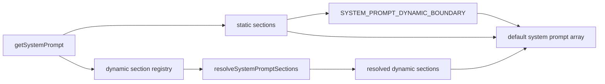
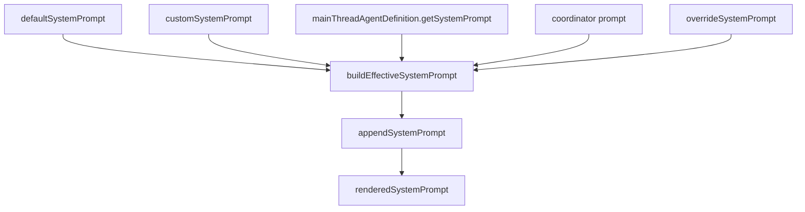
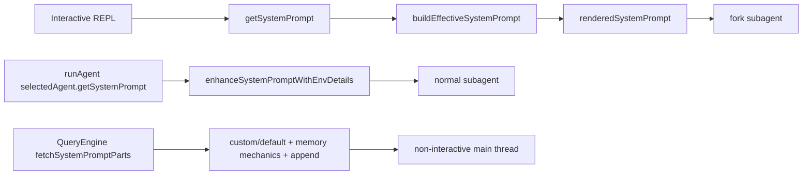

# 深度拆解：Prompts、Config 与系统装配层

这一章关注的不是“prompt 写得好不好”，而是**Claude Code 怎样把 prompt 当作运行时部件来装配**。

如果只看最终发给模型的文本，很容易忽略一个事实：在当前源码里，prompt 至少分成了三层职责：

- 默认 section 工厂
- section 缓存与 dynamic boundary
- 主线程 / agent / fork 的二次装配

## 这部分负责什么

这部分代码主要负责三件事：

- 在 `constants/prompts.ts` 里生成默认主线程 prompt 部件
- 在 `constants/systemPromptSections.ts` 里管理哪些 section 可缓存、哪些必须逐轮重算
- 在 `utils/systemPrompt.ts` 里把 override、coordinator、main-thread agent、custom prompt、default prompt 组合成最终有效 prompt

它还和启动层、agent runtime、memory、skills 直接相连，所以这一章更像“系统 glue”，不是单一 prompt 模板说明。

## 关键文件

- `restored-src/src/main.tsx`
- `restored-src/src/constants/prompts.ts`
- `restored-src/src/constants/systemPromptSections.ts`
- `restored-src/src/utils/systemPrompt.ts`
- `restored-src/src/QueryEngine.ts`
- `restored-src/src/tools/AgentTool/runAgent.ts`
- `restored-src/src/tools/AgentTool/forkSubagent.ts`
- `restored-src/src/tools/AgentTool/loadAgentsDir.ts`

## 执行流

### 1. 默认主 prompt 不是一段常量，而是一组 section

`constants/prompts.ts` 的 `getSystemPrompt()` 返回的不是单一大字符串，而是一组 prompt section。

常规路径下，它的结构可以概括成：

- 静态 section
- 可选 `SYSTEM_PROMPT_DYNAMIC_BOUNDARY`
- 动态 section 的求值结果

动态 section 不是直接内联拼接，而是先注册为 `systemPromptSection(...)` 或 `DANGEROUS_uncachedSystemPromptSection(...)`，再由 `resolveSystemPromptSections(...)` 统一求值。

这一点非常重要，因为这说明 prompt 的边界设计和缓存策略是源码里明确存在的，而不是后处理时临时切的。

### 2. `systemPromptSections.ts` 是缓存层，不是内容层

`constants/systemPromptSections.ts` 提供的不是具体 prompt 文本，而是 section 的缓存控制：

- `systemPromptSection(name, compute)`：普通 section，可缓存
- `DANGEROUS_uncachedSystemPromptSection(...)`：显式标记为每轮重算
- `resolveSystemPromptSections(...)`：统一求值
- `clearSystemPromptSections()`：在 `/clear`、`/compact` 等场景清掉缓存和 beta header latches

因此写文档时，不能把这个文件说成“存放 system prompt 内容”；它更像一层 section cache manager。

### 3. 主线程最终 prompt 还会再做一次优先级装配

`utils/systemPrompt.ts` 的 `buildEffectiveSystemPrompt()` 才是交互式主线程的二次装配器。

当前源码里可以明确读出的优先级是：

1. `overrideSystemPrompt`
2. coordinator prompt
3. `mainThreadAgentDefinition`
4. `customSystemPrompt`
5. `defaultSystemPrompt`

然后：

- `appendSystemPrompt` 总是在最后追加
- proactive 分支下，main-thread agent 不是替换 default，而是追加在 default 后面

这意味着“默认主 prompt 的生成”和“当前 turn 真实用到的 prompt”是两步，不是一回事。

### 4. 交互式主线程、非交互主线程、subagent 不是同一路径

这里是最容易写混的地方。

#### 交互式主线程

交互式主线程会先走：

- `getSystemPrompt(...)`
- `getUserContext()`
- `getSystemContext()`
- `buildEffectiveSystemPrompt(...)`

然后把最终结果挂到 `renderedSystemPrompt`，供 fork 路径复用。

#### 非交互主线程

`QueryEngine.ts` 的 headless/SDK 路径不走 `buildEffectiveSystemPrompt()`。它会先 `fetchSystemPromptParts(...)`，再直接拼：

- `customSystemPrompt` 或 `defaultSystemPrompt`
- 可选 `memoryMechanicsPrompt`
- 可选 `appendSystemPrompt`

也就是说，非交互路径和交互式 REPL 路径在 prompt 装配上并不完全相同。

#### 普通 subagent

普通 subagent 的 system prompt 来源是：

- `agentDefinition.getSystemPrompt(...)`
- 若失败则 fallback 到 `DEFAULT_AGENT_PROMPT`
- 然后 `enhanceSystemPromptWithEnvDetails(...)`

它不是直接拿主线程完整 prompt。

#### fork subagent

fork 是特例。它会优先继承父线程已经渲染好的 `renderedSystemPrompt`；如果拿不到，再回退到“重新取父级默认 prompt + `buildEffectiveSystemPrompt()` 重算”的路径。

源码注释还明确说明了这么做的原因：避免因为 GrowthBook 冷热状态或其他运行时差异导致重算出的 prompt 和父线程不一致。

### 5. `main.tsx` 还处理了非交互 custom main-thread agent 的特判

`main.tsx` 里有一段很值得记住的注释：非交互模式下，如果存在 `mainThreadAgentDefinition`，而且这个 agent 不是 built-in agent，就会直接把 agent 的 prompt 赋给 `systemPrompt`；注释同时写明 interactive mode 会改走 `buildEffectiveSystemPrompt`。

这个细节说明：源码里确实区分了“交互式 main thread agent”和“非交互 main thread agent”的 prompt 注入方式。

## 为什么这个设计重要

这部分设计解释了 Claude Code 的两个关键特征。

第一，它把 prompt 组织做成了**显式运行时结构**：

- section 是命名的
- section 是否可缓存是显式声明的
- 静态与动态之间有明确 boundary

第二，它把主线程、main-thread agent、普通 subagent、fork subagent 区分得很清楚。

这会直接影响：

- prompt cache 能否共享
- agent 是否真正继承父线程上下文
- 交互式与非交互式行为是否一致
- proactive / coordinator / custom prompt 是否按预期叠加

## 推荐阅读顺序

1. `restored-src/src/constants/prompts.ts`
2. `restored-src/src/constants/systemPromptSections.ts`
3. `restored-src/src/utils/systemPrompt.ts`
4. `restored-src/src/main.tsx`
5. `restored-src/src/QueryEngine.ts`
6. `restored-src/src/tools/AgentTool/loadAgentsDir.ts`
7. `restored-src/src/tools/AgentTool/runAgent.ts`
8. `restored-src/src/tools/AgentTool/forkSubagent.ts`

## 仍待确认

- `PROACTIVE`、`KAIROS`、`COORDINATOR_MODE`、`EXPERIMENTAL_SKILL_SEARCH` 等分支在当前真实运行时是否启用。源码只证明分支存在。
- 某个具体会话里最终落地的 prompt 字节内容。因为 memory prompt、output style、MCP instructions、agent 自身 prompt 都依赖运行时输入。
- fork fallback 重算时是否一定与父线程完全一致。源码注释明确提醒过，这条回退路径可能出现差异。
- `KAIROS` 的完整产品含义。当前最稳妥的写法仍然是“相关 proactive/brief 分支与 feature gate 线索”。
