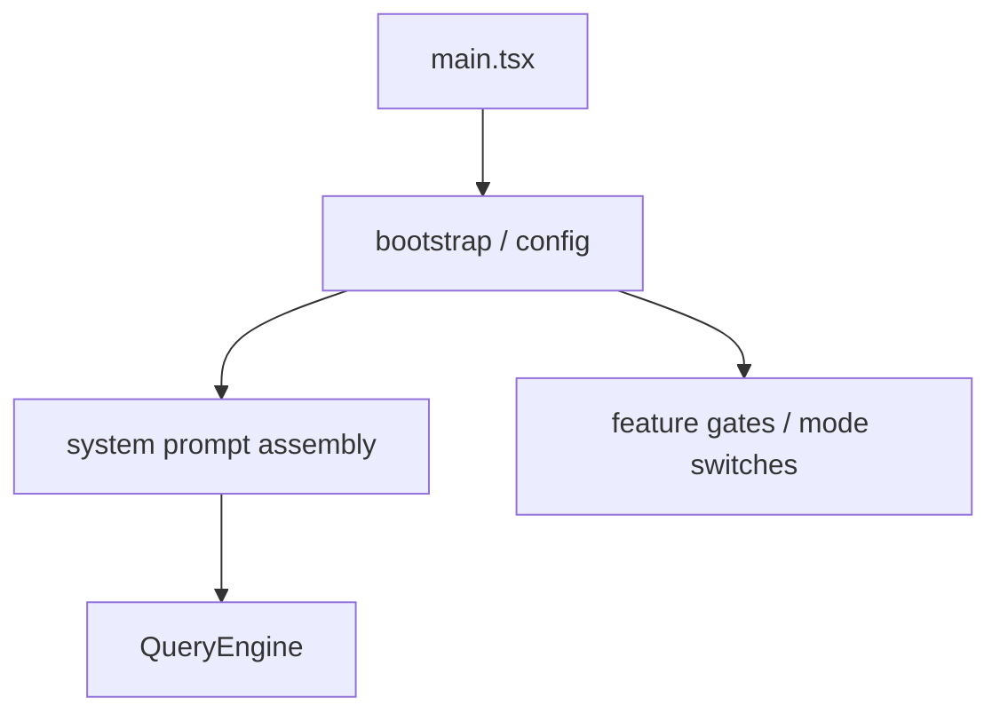

[简体中文](./README.md) | [English](./README.en.md)

# Prompts, Config, And Runtime Glue In One Minute

This chapter groups a few things that keep shaping the whole runtime chain:

## Three Takeaways

- prompts are assembled from multiple parts
- config keeps affecting runtime behavior
- startup decisions continue to shape later paths

## Read Next

- overview: [README.en.md](../README.en.md)
- deep dive: [DEEP/README.en.md](../DEEP/README.en.md)
