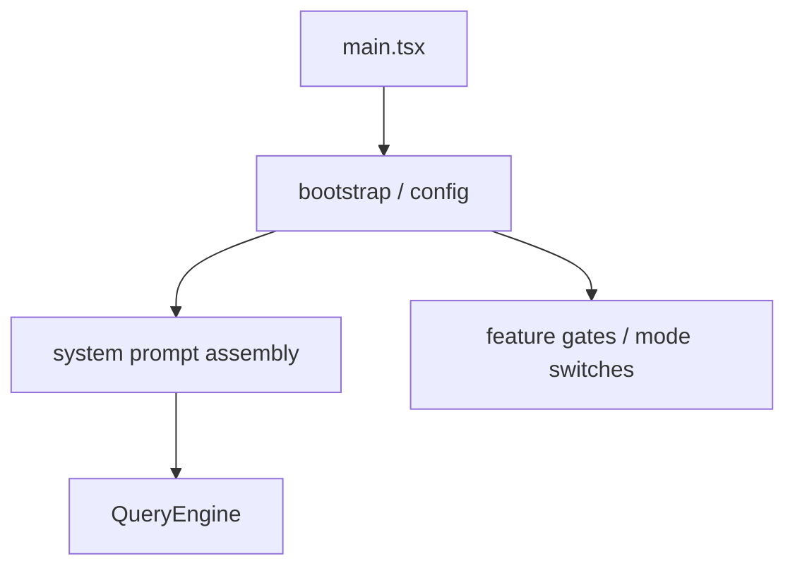

[简体中文](./README.md) | [English](./README.en.md)

# 1 分钟看懂 Prompts, Config, And Runtime Glue

这一章集中说明几件会持续影响整条运行链的事情：

## 三个要点

- prompt 由多段装配而成
- config 会持续影响运行时行为
- 启动阶段已经决定了很多后续路径

## 下一步去哪里

- 总览：[README.md](../README.md)
- 深读：[DEEP/README.md](../DEEP/README.md)
