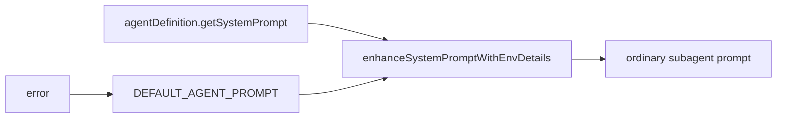
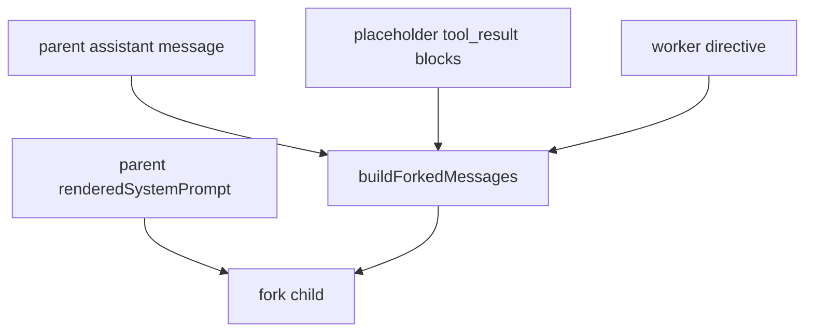

# Agent Prompts

这一页只解释一件事：

**主线程、main-thread agent、普通 subagent、fork subagent 的 prompt 是怎么来的。**

不做的事：

- 不复制大段原始 agent prompt
- 不把 agent prompt 机制简化成“都继承主线程”

## 这部分负责什么

这一页主要讲四件事：

1. 交互式主线程 prompt 从哪里来
2. 非交互主线程为什么不是同一条装配链
3. 普通 subagent 的 prompt 起点是什么
4. fork subagent 为什么要复用 `renderedSystemPrompt`

## 关键文件

- `restored-src/src/utils/systemPrompt.ts`
- `restored-src/src/screens/REPL.tsx`
- `restored-src/src/tools/AgentTool/loadAgentsDir.ts`
- `restored-src/src/tools/AgentTool/runAgent.ts`
- `restored-src/src/tools/AgentTool/forkSubagent.ts`
- `restored-src/src/tools/AgentTool/AgentTool.tsx`
- `restored-src/src/main.tsx`
- `restored-src/src/QueryEngine.ts`

## 执行流

### 1. 源码里至少有 4 条不同路径

这一层最容易写混的地方，是把所有 agent prompt 都当成同一条链。

更准确的分法是：

1. 交互式主线程
2. 非交互主线程
3. 普通 subagent
4. fork subagent

这四条路径都和 prompt 相关，但装配规则并不相同。

### 2. 交互式主线程会在 `REPL.tsx` 里走 `buildEffectiveSystemPrompt()`

在交互式主线程里，`buildEffectiveSystemPrompt()` 会按优先级决定最终生效内容：

- `overrideSystemPrompt`
- coordinator prompt
- `mainThreadAgentDefinition`
- `customSystemPrompt`
- `defaultSystemPrompt`

然后：

- `appendSystemPrompt` 尾追加

这里还要注意一个调用签名差异：

- built-in agent：`getSystemPrompt({ toolUseContext })`
- custom / plugin agent：`getSystemPrompt()`

这说明 built-in agent prompt 可以感知当前工具上下文，而 custom / plugin agent 默认是更静态的 prompt 提供者。

### 3. 非交互主线程不完全一样

`QueryEngine.ts` 这条路径里，主线程不会调用：

- `buildEffectiveSystemPrompt()`

它走的是：

- `fetchSystemPromptParts(...)`
- 取 `defaultSystemPrompt / userContext / systemContext`
- 再直接组合 `custom/default + optional memory mechanics + append`

`main.tsx` 里还有一个单独特判：

- non-interactive 模式下，如果是 custom main-thread agent，会直接把它的 prompt 放进 headless `systemPrompt`

因此文档里如果把“所有主线程 prompt 都走同一条链”写死，会和源码不一致。

### 4. 普通 subagent 的 prompt 起点更适合直接落在 `runAgent.ts`

普通 subagent 走的是 `runAgent.ts`：

1. 进入 `getAgentSystemPrompt(...)`
2. 在里面调 agent 自己的 `getSystemPrompt(...)`
3. 把结果包装成数组
4. 交给 `enhanceSystemPromptWithEnvDetails(...)`
5. 若失败则 fallback 到 `DEFAULT_AGENT_PROMPT`

这里最重要的结论是：

- 普通 subagent 不直接复用主线程完整 prompt
- 它有自己的 prompt 起点和自己的 env / detail 补充层

### 5. fork subagent 是另一套继承模型

`forkSubagent.ts` 这条路径非常特殊。

它不是“再创建一个普通 subagent”，而是更接近：

- 把父线程当前上下文切一份给 worker

关键点有两个。

#### 优先传 `renderedSystemPrompt`

fork 会优先把父线程已经渲染好的：

- `renderedSystemPrompt`

直接传下去。

源码注释里给出的原因很明确：

- 避免重新调用 `getSystemPrompt()` 后出现差异
- 避免 GrowthBook 等运行时状态从 cold 变 warm 导致 prompt 漂移
- 尽量保持 prompt cache 前缀稳定

换成更口语一点的说法就是：

- fork 不是重新算一遍 prompt
- 而是尽量沿用父线程已经算好的那份

#### `promptMessages` 也不是普通 user prompt

普通 subagent 常见的是新的用户任务消息。

fork 不是。它会调用：

- `buildForkedMessages(...)`

去重建：

- 父 assistant message
- 占位 `tool_result`
- worker directive

这条链的目标不是“生成一个新 agent prompt”，而是“尽量继承父线程已经存在的 prompt 和消息前缀”。

### 6. `renderedSystemPrompt` 不是冗余字段

这轮复核后，这一点可以写得更明确。

`renderedSystemPrompt` 存在的意义，不只是“缓存一份字符串”，而是：

- 给 fork 子代理提供稳定的父 prompt 前缀
- 避免重算 prompt 时出现 drift

所以文档里应该直接写：

- `renderedSystemPrompt` 是 fork 稳定性的一部分

### 7. 有些边界仍然要保守

这轮也需要继续收紧两种说法：

- 不能把 `buildSideQuestionFallbackParams()` 里的 `forkContextMessages` 直接等同于 fork 子代理主装配链
- 不能只凭 prompt 相关文件就断言“fork 有完全独立的默认基础 prompt 常量”

目前能稳定确认的是：

- 普通 subagent 走自己的 agent prompt 链
- fork 尽量复用父 `renderedSystemPrompt` 与父消息前缀

## 为什么这个设计重要

这条装配链决定了几个关键事实：

- 主线程 agent prompt 与普通 subagent prompt 不是同一条链
- 普通 subagent 更像“agent 自己的 prompt + env/details”
- fork subagent 才是“尽量继承父线程 prompt 和父消息前缀”的特例

如果不把这几条路径拆开，文档就很容易把 “fork” 和 “普通 worker” 写成同一种东西。

## 推荐阅读顺序

1. `restored-src/src/utils/systemPrompt.ts`
2. `restored-src/src/screens/REPL.tsx`
3. `restored-src/src/main.tsx`
4. `restored-src/src/QueryEngine.ts`
5. `restored-src/src/tools/AgentTool/loadAgentsDir.ts`
6. `restored-src/src/tools/AgentTool/runAgent.ts`
7. `restored-src/src/tools/AgentTool/forkSubagent.ts`
8. `restored-src/src/tools/AgentTool/AgentTool.tsx`

## 仍待确认

- 不同 feature gate 下 fork / proactive / coordinator / built-in agent 的真实启用状态。
- 某个具体运行时里 agent prompt 的最终字节内容。
- fork fallback 重算时与父线程 prompt 的实际偏差范围。源码只说明“可能 diverge”，不能写成绝对一致。
