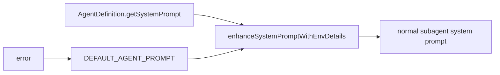
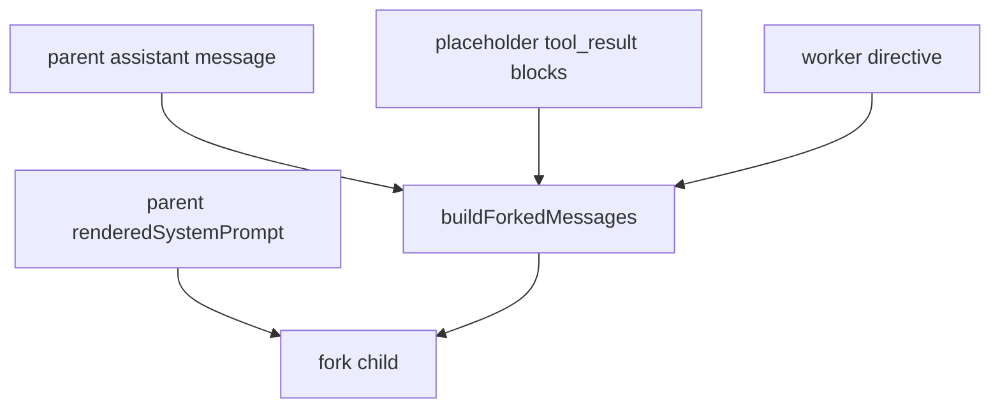

# Agent Prompts

这一页只解释一件事：**主线程、main-thread agent、普通 subagent、fork subagent 的 prompt 是怎么来的。**

不做的事：

- 不复制大段原始 agent prompt
- 不把 agent prompt 机制简化成“都继承主线程”

## 关键文件

- `restored-src/src/utils/systemPrompt.ts`
- `restored-src/src/tools/AgentTool/loadAgentsDir.ts`
- `restored-src/src/tools/AgentTool/runAgent.ts`
- `restored-src/src/tools/AgentTool/forkSubagent.ts`
- `restored-src/src/main.tsx`
- `restored-src/src/QueryEngine.ts`

## 先记住一个总区别

源码里至少有四条不同路径：

- 交互式主线程 prompt
- 非交互主线程 prompt
- 普通 subagent prompt
- fork subagent prompt

它们不是一回事。

## main-thread agent 的 prompt 从哪里来

在交互式主线程里，`buildEffectiveSystemPrompt()` 会按优先级决定当前真正使用的 prompt：

- `overrideSystemPrompt`
- coordinator prompt
- `mainThreadAgentDefinition`
- `customSystemPrompt`
- `defaultSystemPrompt`

这里还要注意一个调用签名差异：

- built-in agent：`getSystemPrompt({ toolUseContext })`
- custom/plugin agent：`getSystemPrompt()`

这说明 built-in agent prompt 可以感知当前工具上下文，而 custom/plugin agent 默认是更静态的 prompt 提供者。

## 非交互主线程为什么不完全一样

`QueryEngine.ts` 这条路径里，主线程不会调用 `buildEffectiveSystemPrompt()`。它走的是：

- `fetchSystemPromptParts(...)`
- 取 `defaultSystemPrompt / userContext / systemContext`
- 再直接拼 `custom/default + optional memory mechanics + append`

`main.tsx` 里还单独处理了一个特判：非交互模式下，如果有 custom main-thread agent，会直接把它的 prompt 放进 `systemPrompt`。

因此，文档里如果把“所有主线程 prompt 都走同一条链”写死，会和源码不一致。

## 普通 subagent 的 prompt 从哪里来

普通 subagent 走的是 `runAgent.ts`：

1. 调 agent 自己的 `getSystemPrompt(...)`
2. 把结果包装成数组
3. 交给 `enhanceSystemPromptWithEnvDetails(...)`
4. 若失败则 fallback 到 `DEFAULT_AGENT_PROMPT`

这里最重要的结论是：

- 普通 subagent 不直接复用主线程完整 prompt
- 它有自己的 prompt 起点和自己的 env/detail 补充层

这也是为什么普通 subagent 和主线程即使在同一个会话里，也不一定共享完全相同的 system prompt 字节。

## fork subagent 为什么是特例

`forkSubagent.ts` 这条路径非常特殊。

它不是“再创建一个普通 subagent”，而是更接近“把父线程当前上下文切一份给 worker”。

关键点有两个：

### 1. 优先传 `renderedSystemPrompt`

fork 会优先把父线程已经渲染好的 `renderedSystemPrompt` 直接传下去。这样做的原因在源码注释里写得很清楚：

- 避免重新调用 `getSystemPrompt()` 后出现差异
- 避免 GrowthBook 等运行时状态从 cold 变 warm 造成 prompt 漂移
- 尽量保持 prompt cache 前缀稳定

如果拿不到 `renderedSystemPrompt`，才会回退到“重算父级 prompt”的路径。

### 2. `promptMessages` 也不是普通 user prompt

普通 subagent 常见的是一个新的用户消息。

fork 不是。它会调用 `buildForkedMessages(...)`：

- 保留父 assistant message
- 收集父消息里的 `tool_use`
- 给这些 `tool_use` 生成统一 placeholder `tool_result`
- 再追加 worker directive

这样做是为了让多个 fork child 尽可能共享字节级一致的前缀。

## agent 定义本身怎么区分 built-in / custom / plugin

`loadAgentsDir.ts` 把 agent 分成：

- `BuiltInAgentDefinition`
- `CustomAgentDefinition`
- `PluginAgentDefinition`

这个区分不只是来源不同，也影响 prompt 获取方式：

- built-in agent 的 `getSystemPrompt` 带 `toolUseContext`
- custom / plugin agent 的 `getSystemPrompt` 不带参数

另外，agent frontmatter 还能带：

- `tools`
- `skills`
- `mcpServers`
- `hooks`
- `memory`
- `initialPrompt`
- `permissionMode`

这些字段会在 `runAgent.ts` 里进一步影响 worker 的运行方式，但并不会自动把普通 subagent 变成“完整继承主线程 prompt”的 fork。

## 可以直接记住的结论

- 主线程 agent prompt 和普通 subagent prompt 不是同一条装配链。
- 普通 subagent 是“agent 自己的 prompt + env/details”。
- fork subagent 才是“尽量继承父线程已渲染 prompt + 继承父消息上下文”的特例。
- `renderedSystemPrompt` 的存在不是多余字段，而是 fork 路径稳定性的一部分。

## 仍待确认

- 不同 feature gate 下 fork / proactive / coordinator / built-in agent 的真实启用状态。
- 某个具体运行时里 agent prompt 的最终字节内容。
- fork fallback 重算时与父线程 prompt 的实际偏差范围。源码只说明“可能 diverge”，不能写成绝对一致。
