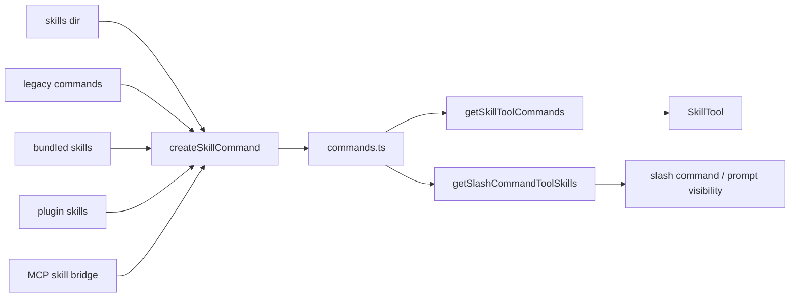

# Skills And Command Injection

这一页解释的是：**skill 在源码里如何从 `SKILL.md` 变成 `Command`，再进入模型可见上下文。**

这件事不能只看 `SkillTool.ts`。真正的路径横跨：

- `skills/loadSkillsDir.ts`
- `commands.ts`
- `tools/SkillTool/SkillTool.ts`
- `utils/processUserInput/processSlashCommand.tsx`
- `utils/attachments.ts`

## 关键文件

- `restored-src/src/skills/loadSkillsDir.ts`
- `restored-src/src/skills/bundledSkills.ts`
- `restored-src/src/skills/mcpSkillBuilders.ts`
- `restored-src/src/commands.ts`
- `restored-src/src/tools/SkillTool/SkillTool.ts`
- `restored-src/src/tools/SkillTool/prompt.ts`
- `restored-src/src/utils/processUserInput/processSlashCommand.tsx`
- `restored-src/src/utils/attachments.ts`
- `restored-src/src/utils/plugins/loadPluginCommands.ts`

## 第一步：skill 先被解析成 `Command`

`loadSkillsDir.ts` 的中心不是“直接执行 skill”，而是把 skill 解析成 `Command`。

它会先走 `parseSkillFrontmatterFields(...)`，把 frontmatter 里的关键信息提出来，例如：

- `allowedTools`
- `argumentHint`
- `whenToUse`
- `model`
- `disableModelInvocation`
- `hooks`
- `context`
- `agent`
- `effort`
- `paths`
- `shell`

然后再调用 `createSkillCommand(...)`，真正构造一个 `type: 'prompt'` 的 `Command`。

这一步很关键，因为它说明 skill 在源码里不是“附加文本”，而是进入统一命令系统的对象。

## 第二步：skill 来源不只一种

当前源码里至少有四种来源：

- 本地 `skills/`
- legacy `commands/`
- bundled skills
- plugin skills

另外，MCP skill 还有一条桥接路径，但在当前镜像里主要能确认的是 builder registry，不是完整实现。

### 本地 `skills/`

`/skills/` 目录只支持 `skill-name/SKILL.md` 这种目录布局。

带 `paths` frontmatter 的 skill 不会立刻进入可用列表，而是先进入 conditional skill 集合，等文件操作命中对应路径后再激活。

### legacy `commands/`

legacy `.claude/commands` 同时支持单文件和 `SKILL.md` 目录格式。

### bundled skills

`bundledSkills.ts` 维护的是进程内注册表。若某个 bundled skill 带有附属文件，这些文件会在首次调用时惰性落盘，然后再把 `Base directory for this skill:` 前缀补到 prompt 前面。

### plugin skills

plugin skill 的主要加载逻辑不在 `src/plugins/`，而在 `utils/plugins/loadPluginCommands.ts`。

当前镜像里，plugin skill 会：

- 只从已启用插件加载
- 自动带上 `pluginName:` 前缀
- 支持目录技能和子目录 `SKILL.md`

### MCP skills

`mcpSkillBuilders.ts` 当前能确认的职责是：提供一个 write-once registry，让 `loadSkillsDir.ts` 暴露 `createSkillCommand` 与 `parseSkillFrontmatterFields` 给 MCP skill discovery 复用，避免循环依赖。

因此当前最稳妥的写法是：**MCP skill 有桥接设计，但这份镜像中更完整的发现实现不在当前 `src/skills/` 树里。**

## 第三步：`commands.ts` 决定哪些 skill 进入模型可见面

`commands.ts` 会把多路技能合并进命令系统：

- 本地 skill / legacy command
- plugin skills
- bundled skills
- builtin plugin skills

然后 `getSkillToolCommands(cwd)` 再从这些命令里筛出“可由模型调用的 prompt commands”。

这个筛选条件很重要：

- 必须是 `type === 'prompt'`
- 不能 `disableModelInvocation`
- 不能是 builtin command
- 某些来源还要求有明确描述或 `whenToUse`

也就是说，模型能看到的 skill 列表，不等于磁盘上所有 skill 文件。

## 第四步：动态 skill 发现不是 SkillTool 触发的

这是一个很容易写错的点。

当前源码里，动态 skill 发现主要发生在文件工具侧，而不是 SkillTool 自己：

- `FileReadTool`
- `FileEditTool`
- `FileWriteTool`

这些工具在处理路径时会调用：

- `discoverSkillDirsForPaths()`
- `addSkillDirectories()`
- `activateConditionalSkillsForPaths()`

因此，“读/写/编辑文件后技能列表发生变化”是源码里的真实行为，而且是由文件工具触发的。

## 第五步：SkillTool 负责执行，不负责发现

`SkillTool.ts` 是执行壳。

它会先做：

- `validateInput()`
- `checkPermissions()`

然后根据 skill 的属性走三条路径：

- inline
- `context === 'fork'` 的 subagent 路径
- feature-gated remote canonical skill 路径

inline 路径最值得看。它最终会调用 `processPromptSlashCommand()`，后者再调用 `command.getPromptForCommand()`，并补上：

- hooks 注册
- invoked skill 记录
- attachments
- `command_permissions`

所以源码里的真实结构是：

- skill 先变成 `Command`
- SkillTool 只是在运行时调用这个 `Command`
- 真正把 skill 内容注入会话的是 `processPromptSlashCommand()`

## 第六步：模型看到的 skill，不是硬编码文本，而是 attachment

当前 skill 可见性主要通过 attachment 系统完成：

- `skill_listing`：当前可调用 skill 列表
- `dynamic_skill`：新发现的技能目录提示
- `invoked_skills`：已经调用过的 skill 内容，供 compact / resume 后保留

这说明 SkillTool prompt 不是唯一信息来源。模型看到的技能面，是：

- Tool prompt
- 命令聚合结果
- attachment 注入
- 已调用 skill 的恢复内容

共同形成的。

## plugin skill 和普通 skill 的边界

当前镜像里最稳妥的边界划分是：

- 普通 skill：来自磁盘上的 `.claude/skills` 或 legacy `.claude/commands`
- plugin skill：来自已启用插件，并自动带命名空间前缀
- bundled skill：进程内注册，不依赖用户磁盘目录
- MCP skill：通过 builder registry 预留桥接，但完整发现实现需谨慎表述

另外，当前 `src/plugins/bundled/index.ts` 的 `initBuiltinPlugins()` 是空实现，这意味着 builtin plugin 机制已经搭好，但在这份镜像里看不到实际注册的 builtin plugin 定义。

## 可以直接记住的结论

- skill 在源码里首先是 `Command`，其次才是可执行 prompt。
- SkillTool 是执行壳，不是发现源。
- 动态 skill 发现主要由文件工具触发。
- 模型看到的 skill 列表主要通过 attachment 注入，而不是写死在一段 prompt 文本里。
- plugin skill、bundled skill、普通 skill、MCP skill 的来源与命名空间不同，不能混写成一类。
