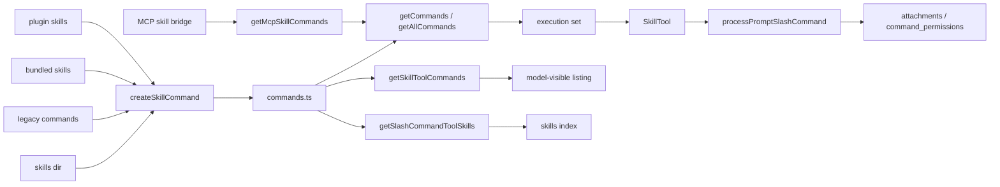

# Skills And Command Injection

这一页解释的是：

**skill 在源码里如何从 `SKILL.md` 变成 `Command`，再进入模型可见上下文。**

这件事不能只看 `SkillTool.ts`。真正的路径横跨：

- `skills/loadSkillsDir.ts`
- `commands.ts`
- `tools/SkillTool/SkillTool.ts`
- `utils/processUserInput/processSlashCommand.tsx`
- `utils/attachments.ts`

## 这部分负责什么

这一页主要讲五件事：

1. skill 怎么先被生产成 `Command(type: 'prompt')`
2. 技能来源有哪些
3. `commands.ts` 如何决定哪些 skill 进入命令层与 listing
4. SkillTool 为什么只是执行壳
5. plugin skill 与普通 skill 的边界在哪里

## 关键文件

- `restored-src/src/skills/loadSkillsDir.ts`
- `restored-src/src/skills/bundledSkills.ts`
- `restored-src/src/skills/mcpSkillBuilders.ts`
- `restored-src/src/commands.ts`
- `restored-src/src/tools/SkillTool/SkillTool.ts`
- `restored-src/src/tools/SkillTool/prompt.ts`
- `restored-src/src/utils/processUserInput/processSlashCommand.tsx`
- `restored-src/src/utils/attachments.ts`
- `restored-src/src/utils/plugins/loadPluginCommands.ts`

## 执行流

### 1. skill 先被生产成 `Command`

`loadSkillsDir.ts` 的中心不是“直接执行 skill”，而是把 skill 解析成：

- `Command(type: 'prompt')`

它会先走：

- `parseSkillFrontmatterFields(...)`

把 frontmatter 里的关键信息提出来，例如：

- `allowedTools`
- `argumentHint`
- `whenToUse`
- `model`
- `disableModelInvocation`
- `hooks`
- `context`
- `agent`
- `effort`
- `paths`
- `shell`

然后再调用：

- `createSkillCommand(...)`

真正构造命令对象。

这一步很关键，因为它说明 skill 在源码里不是“附加文本”，而是先进入统一命令系统。

### 2. 技能来源不是单一路径

当前源码里至少能确认这些来源：

- `/skills/<name>/SKILL.md`
- legacy `/commands/`
- bundled skill 注册表
- 已启用插件里的 `skills/`
- 运行时从 `AppState.mcp.commands` 补入的 MCP skills

其中有几个边界要写清楚：

- `/skills/` 下只认目录式 `SKILL.md`
- legacy `/commands/` 仍支持单文件 `.md` 与目录式 `SKILL.md`
- MCP skills 不在 `getCommands()` 主注册表里，而是由 SkillTool 执行时补入

### 3. conditional / dynamic skills 不是 SkillTool 触发的

`loadSkillsDir.ts` 里还维护了两组很重要的集合：

- `conditionalSkills`
- `dynamicSkills`

触发逻辑主要来自文件操作：

- `discoverSkillDirsForPaths()`
- `addSkillDirectories()`
- `activateConditionalSkillsForPaths()`

也就是说，“读 / 写 / 编辑文件后 skill 集合发生变化”这件事，主要是文件工具侧触发的，不是 SkillTool 自己扫描出来的。

### 4. `commands.ts` 决定命令层与 listing

`commands.ts` 会把多路技能合并进统一命令系统：

- skill dir commands
- plugin commands
- plugin skills
- bundled skills
- built-in plugin skills
- workflow commands
- hard-coded commands

这里要特别注意 3 个集合：
这里要特别注意 4 个集合：

#### 执行集合

执行侧更宽，SkillTool 在执行时会通过：

- `getAllCommands()`

查命令。

这个集合还会额外把：

- `AppState.mcp.commands` 中 `loadedFrom === 'mcp'` 的 prompt commands

补进来。

#### 模型 listing 集合

模型看到的 skill listing 更窄，来自：

- `getSkillToolCommands()`

它会额外过滤：

- 只保留 `type === 'prompt'`
- 排除 built-in commands
- `disableModelInvocation` 的项不会进入 listing
- plugin / MCP 项通常需要显式 `description` 或 `whenToUse`

#### 技能索引集合

还有一组更接近菜单 / 技能索引的集合：

- `getSlashCommandToolSkills()`

它和 `getSkillToolCommands()` 也不是同一个结果。

#### MCP skill 补集

还有一组只针对 `AppState.mcp.commands` 的过滤函数：

- `getMcpSkillCommands()`

它只保留：

- `type === 'prompt'`
- `loadedFrom === 'mcp'`
- `disableModelInvocation !== true`

所以文档里一定要把这 3 个集合分开写。

更直白一点说：

- 模型看得到的 skill，不等于运行时真能执行到的全部 skill
- 运行时还能在本地命令集合之外，再补一层 MCP skill 集合

### 5. SkillTool 是执行壳，不是 discovery 源

`SkillTool.ts` 做的事情是：

1. `validateInput()`
2. 从执行集合里查命令
3. `checkPermissions()`
4. 按 `context === 'fork'` 或 inline 路径执行
5. 调 `processPromptSlashCommand()` 把内容重新注入会话

这说明真实结构应该写成：

- `loadSkillsDir.ts` 负责发现与生产
- `commands.ts` 负责装配
- `SkillTool.ts` 负责执行
- `processPromptSlashCommand()` 负责把 skill 展开成正文、metadata、attachment 和 `command_permissions`

而不是：

- “SkillTool 自己发现并运行所有 skills”

### 6. plugin command 与 plugin skill 入口不同，但共用同一构造器

这是这一轮要特别强调的点。

`utils/plugins/loadPluginCommands.ts` 里：

- `getPluginCommands()` 处理 plugin `commands/`
- `getPluginSkills()` 处理 plugin `skills/`

它们的入口和过滤规则并不相同，但最终会落到同一个命令构造器。

`commands/` 支持：

- 普通 `.md`
- 目录式 `SKILL.md`
- manifest 路径数组
- 对象映射
- inline content

`skills/` 则更严格：

- 只认目录里的 `SKILL.md`
- 不把普通 markdown 文件当 skill
- 命名统一是 `pluginName:skillName`

另外还有一个容易写错的叶子规则：

- 在 plugin `commands/` 树中，如果某目录含 `SKILL.md`
- 该目录会被当作 skill 叶子目录
- 同目录其他 `.md` 不会再各自产生命令

所以更准确的说法是：

- plugin command 与 plugin skill 不是两套完全不同的命令对象
- 它们共享同一个构造器
- 主要差别落在 `loadedFrom`、发现路径和过滤条件

### 7. built-in plugin skill 不是单独的 source 类型

当前源码里：

- plugin 产物统一是 `source: 'plugin'`
- built-in plugin 导出的 skills 会被转换成 `source: 'bundled', loadedFrom: 'bundled'`

所以文档里不要再写：

- “builtin plugin skill 是 SkillTool 可见的独立 source 类型”

更稳妥的写法是：

- built-in plugin skill 在命令层会落到 bundled 一侧

### 8. built-in plugin 机制目前仍是 scaffolding

这轮复核还能更明确写出：

- `main.tsx` 启动阶段会调用 `initBuiltinPlugins()`
- `initBuiltinPlugins()` 在当前镜像里是空实现
- 本轮没有看到实际 `registerBuiltinPlugin(...)` 调用
- 真正已经有实际注册内容的是 `initBundledSkills()`

所以可以写：

- 当前支持 built-in plugin registry / scaffold，且启动接线已经存在

但不要写：

- 当前已有 built-in plugin skills 在运行

## 为什么这个设计重要

这条链路说明 Claude Code 的 skill 不是“prompt 文本拼接”那么简单。

它先被生产成 `Command`，再按不同来源进入命令层，最后通过：

- listing
- slash command
- SkillTool
- attachments

一起进入模型可见面。

这样做的好处是：

- skill 可以像命令一样被治理
- plugin / bundled / MCP skill 可以共享同一套执行壳
- listing 与执行集合可以分开控制
- built-in plugin 虽然当前没有实际注册项，但启动入口已经固定在 `main.tsx`

## 推荐阅读顺序

1. `restored-src/src/skills/loadSkillsDir.ts`
2. `restored-src/src/skills/bundledSkills.ts`
3. `restored-src/src/commands.ts`
4. `restored-src/src/tools/SkillTool/SkillTool.ts`
5. `restored-src/src/tools/SkillTool/prompt.ts`
6. `restored-src/src/utils/plugins/loadPluginCommands.ts`
7. `restored-src/src/skills/mcpSkillBuilders.ts`
8. `restored-src/src/utils/processUserInput/processSlashCommand.tsx`
9. `restored-src/src/utils/attachments.ts`

## 仍待确认

- `mcpSkillBuilders.ts` 明确说明 MCP skill discovery 会复用 `createSkillCommand` 和 `parseSkillFrontmatterFields`，但本轮没有继续展开 `mcpSkills.ts`，所以不能把完整 MCP skill 发现时机和缓存策略写得更细。
- `processPromptSlashCommand()` 与 `SkillsMenu` 的内部细节，这一页不继续展开到 UI / message 级别。
- bundled skills 与 built-in plugins 的真实启动调用点，不在本轮重点范围内；这里只确认 registry / scaffold 和装配代码存在。
