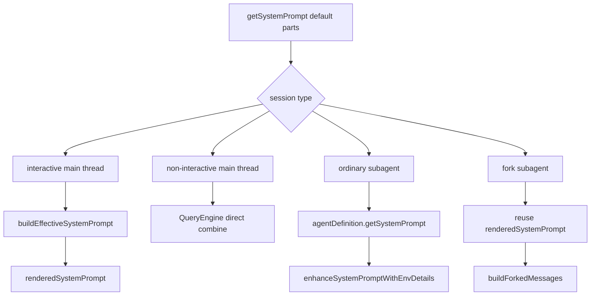

# System Prompt Assembly

这一页只解释一件事：

**Claude Code 的 system prompt 不是一段固定长文本，而是一套分阶段装配链。**

这里不贴大段 raw prompt，只讲装配机制和优先级。

## 关键文件

- `restored-src/src/constants/prompts.ts`
- `restored-src/src/constants/systemPromptSections.ts`
- `restored-src/src/utils/systemPrompt.ts`
- `restored-src/src/utils/queryContext.ts`
- `restored-src/src/QueryEngine.ts`
- `restored-src/src/screens/REPL.tsx`
- `restored-src/src/tools/AgentTool/AgentTool.tsx`
- `restored-src/src/tools/AgentTool/runAgent.ts`
- `restored-src/src/tools/AgentTool/forkSubagent.ts`
- `restored-src/src/tools/AgentTool/resumeAgent.ts`

## 先分清四条装配路径

这一层最容易写混的地方，是把所有 prompt 都当成同一套链。

更准确的分法是：

1. interactive 主线程
2. non-interactive 主线程
3. 普通 subagent
4. fork subagent

这四条路径都和 `getSystemPrompt()` 有关系，但后续的组装规则并不相同。

## 第一步：`getSystemPrompt()` 先生成默认 prompt parts

`restored-src/src/constants/prompts.ts` 里的 `getSystemPrompt()` 返回的是 `string[]`，不是一整段最终字符串。

它会先生成：

- static sections
- dynamic sections

然后在两者之间插入：

- `SYSTEM_PROMPT_DYNAMIC_BOUNDARY`

这样做的目的，不只是为了排版，而是为了把静态前缀和动态段分开管理。

当前常规主线程默认 parts 的结构，可以概括成：

- 静态段
  - intro
  - system
  - doing tasks
  - actions
  - using your tools
  - tone and style
  - output efficiency
- 动态段
  - `session_guidance`
  - `memory`
  - `ant_model_override`
  - `env_info_simple`
  - `language`
  - `output_style`
  - `mcp_instructions`
  - `scratchpad`
  - `frc`
  - `summarize_tool_results`
  - 以及若干 feature-gated 可选段

## 第二步：dynamic sections 不是随手拼接，而是 registry

dynamic sections 在 `prompts.ts` 里不是裸函数数组，而是通过：

- `systemPromptSection(...)`
- `DANGEROUS_uncachedSystemPromptSection(...)`

注册出来，再交给：

- `resolveSystemPromptSections()`

求值。

这意味着默认 prompt parts 不是“字符串拼接脚本”，而是一套带缓存语义的 section registry。

## 第三步：interactive 主线程才走 `buildEffectiveSystemPrompt()`

`restored-src/src/utils/systemPrompt.ts` 负责 interactive 主线程的最终裁决。

当前源码可确认的 precedence 是：

1. `overrideSystemPrompt`
2. coordinator prompt
   - 只在没有 `mainThreadAgentDefinition` 时生效
3. `mainThreadAgentDefinition`
4. `customSystemPrompt`
5. `defaultSystemPrompt`
6. `appendSystemPrompt`
   - 只要不是 override，就始终尾追加

这里还有一个很重要的分支：

- 平时，main-thread agent prompt 会替换 default prompt
- proactive / KAIROS 激活时，main-thread agent prompt 会作为 `# Custom Agent Instructions` 追加在 default prompt 后面

所以“agent prompt 是否替换默认 prompt”本身也是运行时相关的。

## 第四步：non-interactive 主线程不走这条 precedence

这点非常重要，也最容易被文档写错。

non-interactive 主线程不会走 `buildEffectiveSystemPrompt()`。

它的路径是：

- `main.tsx` 把 `systemPrompt` / `appendSystemPrompt` 交给 `runHeadless`
- `print.ts` 再把它们传给 `ask()`
- `QueryEngine` 通过 `fetchSystemPromptParts()` 和本地逻辑直接组装最终 prompt

更具体地说，`QueryEngine` 组装的是：

- `(customSystemPrompt ?? defaultSystemPrompt)`
- `+ memoryMechanicsPrompt?`
- `+ appendSystemPrompt`

同时，`queryContext.ts` 还能确认一件事：

- 只要 `customSystemPrompt` 存在，就会跳过 `getSystemPrompt()` 和 `getSystemContext()`

另外，`main.tsx` 在 headless 下只对一种情况做了额外预注入：

- main-thread agent 是自定义 agent

这里并不会自动套用 interactive 那套 built-in main-thread agent precedence。

## 第五步：普通 subagent 有自己的 prompt 链

普通 subagent 不复用主线程 default prompt。

它的基底是：

- `agentDefinition.getSystemPrompt()`

然后再经过：

- `enhanceSystemPromptWithEnvDetails()`

补环境信息和 agent-thread 约束。

如果 agent 自己的 `getSystemPrompt()` 失败，还会退回：

- `DEFAULT_AGENT_PROMPT`

所以更准确的写法应该是：

- 普通 subagent 拥有自己的 agent prompt 链
- 它不是“主线程 prompt 的简单子集”

## 第六步：fork subagent 是另一套模型

fork subagent 和普通 subagent 的差异非常大。

它只在：

- interactive
- 非 coordinator
- fork gate 开启
- 并且省略 `subagent_type`

时触发。

一旦进入 fork：

- 优先复用父线程已经渲染好的 `renderedSystemPrompt`
- 复用父线程精确 tools
- 复用父线程 `thinkingConfig`
- 用 `buildForkedMessages()` 重建父 assistant 消息、占位 `tool_result` 和 fork directive

这条链的目标不是“开一个新 agent prompt”，而是“尽量复制父线程前缀，继续做事”。

resume fork 也会继续保持这条策略，而不是退回普通 subagent 的 prompt 生成方式。

## 一张图看四条装配路径

## 为什么这条链重要

这条装配链决定了几个很关键的事实：

- default prompt 不是最终 prompt
- interactive 与 non-interactive 的 precedence 不同
- 普通 subagent 与 fork subagent 的模型完全不同
- `appendSystemPrompt`、main-thread agent、coordinator、custom prompt 都不是随手追加一句，而是有明确优先级

如果不把这几条路径分开，很多文档就会把源码行为写错。

## 已确认的事实

- `getSystemPrompt()` 返回的是默认 prompt parts，而不是最终 prompt
- interactive 主线程走 `buildEffectiveSystemPrompt()`
- non-interactive 主线程不走 `buildEffectiveSystemPrompt()`
- 普通 subagent 使用自己的 agent prompt
- fork subagent 复用父级 `renderedSystemPrompt`
- proactive / KAIROS 激活时，main-thread agent prompt 从“替换”改为“追加”

## 仍待确认

- `FORK_SUBAGENT`、`PROACTIVE`、`KAIROS`、`COORDINATOR_MODE` 等 gate 的线上默认状态，不能从静态源码直接推出
- 各具体 agent 定义里的 `getSystemPrompt()` 文本内容，这一页不展开
