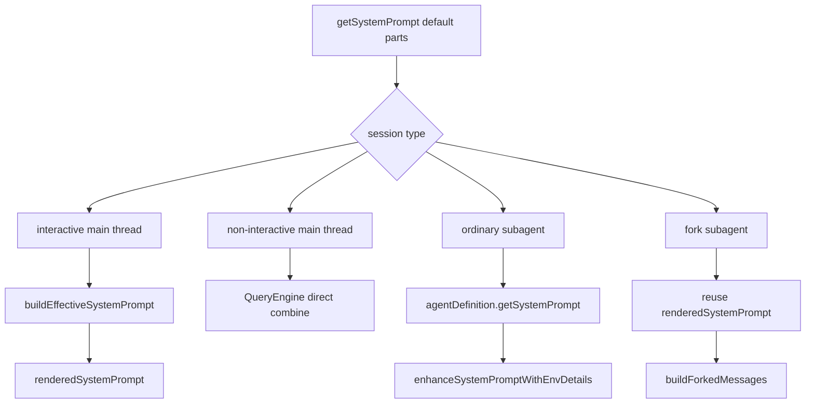

# System Prompt Assembly

这一页只解释一件事：

**Claude Code 的 system prompt 不是一段固定长文本，而是一套分阶段装配链。**

这里不贴大段 raw prompt，只讲装配机制、优先级和边界。

## 这部分负责什么

这一页主要说明四件事：

1. `getSystemPrompt()` 如何产出 default prompt parts
2. interactive 主线程如何走 `buildEffectiveSystemPrompt()`
3. non-interactive 主线程为什么不是同一条 precedence
4. 普通 subagent 与 fork subagent 在 prompt 装配上到底差在哪里

## 关键文件

- `restored-src/src/constants/prompts.ts`
- `restored-src/src/constants/systemPromptSections.ts`
- `restored-src/src/utils/systemPrompt.ts`
- `restored-src/src/utils/queryContext.ts`
- `restored-src/src/QueryEngine.ts`
- `restored-src/src/tools/AgentTool/AgentTool.tsx`
- `restored-src/src/tools/AgentTool/runAgent.ts`
- `restored-src/src/tools/AgentTool/forkSubagent.ts`

## 执行流

### 1. `getSystemPrompt()` 先生成 default prompt parts

`constants/prompts.ts` 里的 `getSystemPrompt()` 返回的是：

- `string[]`

不是：

- 最终拼好的单段字符串

标准路径里，它会先构造：

- 静态前缀
- 动态 sections

然后在两者之间插入：

- `SYSTEM_PROMPT_DYNAMIC_BOUNDARY`

也就是说，default prompt 在这一层已经被明确拆成：

- static
- dynamic

这不是排版问题，而是缓存边界设计。

### 2. 标准路径与 proactive / KAIROS 路径不是一回事

当前 `getSystemPrompt()` 至少有三条路径：

1. `CLAUDE_CODE_SIMPLE`
   - 返回极简单段 prompt
2. proactive / KAIROS 激活
   - 走 autonomous agent 风格路径
   - 不走标准 section registry
3. 常规路径
   - 先构造 dynamic sections
   - 再通过 `resolveSystemPromptSections()` 求值

所以文档里要把“标准路径”与“特化路径”分开写，不要混成一个通用流程。

### 3. interactive 主线程才走 `buildEffectiveSystemPrompt()`

`utils/systemPrompt.ts` 负责 interactive 主线程的最终折叠。

当前源码里可确认的 precedence 是：

1. `overrideSystemPrompt`
2. `coordinator prompt`
3. `mainThreadAgentDefinition`
4. `customSystemPrompt`
5. `defaultSystemPrompt`
6. `appendSystemPrompt`

其中：

- 只要不是 override
- `appendSystemPrompt` 就会被尾追加

还有一个非常重要的分支：

- 平时 main-thread agent prompt 会替换 default
- proactive / KAIROS 激活时，main-thread agent prompt 会作为 `# Custom Agent Instructions` 追加在 default 后面

所以“agent prompt 是否替换默认 prompt”本身也是运行时相关的。

### 4. non-interactive 主线程不是同一条 precedence

这一点很容易被写错。

non-interactive 主线程不会走：

- `buildEffectiveSystemPrompt()`

它的链路是：

1. `main.tsx` 把 `systemPrompt` / `appendSystemPrompt` 交给 headless 路径
2. `QueryEngine` 通过 `fetchSystemPromptParts()` 取得 default / user / system context
3. 再本地组合：
   - `customSystemPrompt ?? defaultSystemPrompt`
   - `+ memoryMechanicsPrompt?`
   - `+ appendSystemPrompt`

而且：

- 只要 `customSystemPrompt` 存在
- `queryContext.ts` 就会跳过 `getSystemPrompt()` 和 `getSystemContext()`

这也是为什么 interactive 与 non-interactive 不能写成“一样的 prompt，只是 UI 不同”。

### 5. 普通 subagent 有自己的 prompt 起点

普通 subagent 不复用主线程 default prompt。

它的起点来自：

- `agentDefinition.getSystemPrompt()`

然后再经过：

- `enhanceSystemPromptWithEnvDetails()`

如果 agent 自己的 `getSystemPrompt()` 失败，才退回：

- `DEFAULT_AGENT_PROMPT`

所以更准确的说法是：

- 普通 subagent 有自己的 agent prompt 链
- 它不是主线程 prompt 的简单子集

### 6. fork subagent 是另一套上下文继承模型

fork subagent 和普通 subagent 的差异非常大。

它的目标不是：

- “开一个新 agent prompt”

而是：

- 尽量复用父线程已经渲染好的 prompt 前缀和消息前缀

当前可确认的关键点有：

- 优先复用父 `renderedSystemPrompt`
- 复用父精确工具池
- 复用父 `thinkingConfig`
- 用 `buildForkedMessages()` 重建父 assistant 消息与占位 `tool_result`

这里有一个需要特别保守的地方：

- 本轮能确认 fork 复用父 prompt 与父消息前缀
- 但仅凭 prompt 相关文件本身，看不到“fork 专属默认基础 prompt 常量”

所以文档不要写成：

- “fork 自带完全独立的默认基础 prompt”

### 7. `getAgentToolSection()` 也属于 prompt 装配的一部分

当前主线程默认 prompt 里，和子代理相关的一段说明来自：

- `getAgentToolSection()`

而这段文案本身又和 fork gate 相关：

- fork 开启时，说明“不带 `subagent_type` 会创建 fork”
- fork 未开启时，说明“使用 specialized agents”

它被放在 dynamic boundary 之后，不是偶然，而是为了避免把这类运行时分支污染全局可缓存静态前缀。

## 一张图看 4 条装配路径

## 为什么这个设计重要

这条装配链决定了几个非常关键的事实：

- default prompt 不是最终 prompt
- interactive 与 non-interactive 的 precedence 不同
- 普通 subagent 与 fork subagent 的 prompt 模型不同
- `appendSystemPrompt`、main-thread agent、coordinator、custom prompt 都有明确优先级

如果不把这几条路径拆开，文档就很容易把源码行为写错。

## 推荐阅读顺序

1. `restored-src/src/constants/prompts.ts`
2. `restored-src/src/constants/systemPromptSections.ts`
3. `restored-src/src/utils/systemPrompt.ts`
4. `restored-src/src/utils/queryContext.ts`
5. `restored-src/src/QueryEngine.ts`
6. `restored-src/src/tools/AgentTool/AgentTool.tsx`
7. `restored-src/src/tools/AgentTool/runAgent.ts`
8. `restored-src/src/tools/AgentTool/forkSubagent.ts`

## 仍待确认

- `SYSTEM_PROMPT_DYNAMIC_BOUNDARY` 在 API 层如何切分 prompt block，这一页没有继续展开到 API 实现。
- `isForkSubagentEnabled()` 的完整判定条件，这一页只确认它与 non-interactive / fork gate 有关，不继续展开所有开关。
- `buildSideQuestionFallbackParams()` 里的 `forkContextMessages` 名字带 `fork`，但不能直接等同于 fork 子代理主装配链。
