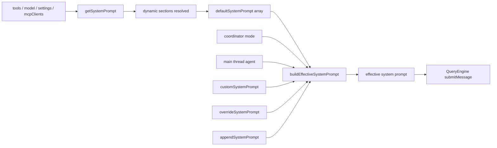

# System Prompt Assembly

这一页只回答一个问题：**Claude Code 的 system prompt 到底是怎么装起来的。**

这里不贴长原文，只讲装配链和优先级。

## 关键文件

- `restored-src/src/constants/prompts.ts`
- `restored-src/src/constants/systemPromptSections.ts`
- `restored-src/src/utils/systemPrompt.ts`
- `restored-src/src/QueryEngine.ts`

## 先看整体链路

## 第一步：`getSystemPrompt()` 先构建默认 prompt 数组

入口在 `restored-src/src/constants/prompts.ts` 的 `getSystemPrompt()`。

从源码可以确认，它不是返回一整段固定文本，而是返回一个 `string[]`：

- simple mode 走一条更短的路径
- proactive / KAIROS active 时走另一条更简化的 autonomous path
- 普通路径下，会先准备一组 static sections，再准备 dynamic sections

其中 dynamic sections 是通过 `systemPromptSection()` 和 `DANGEROUS_uncachedSystemPromptSection()` 构造，再交给 `resolveSystemPromptSections()` 计算。

## 第二步：static 和 dynamic 在 `SYSTEM_PROMPT_DYNAMIC_BOUNDARY` 处分开

`restored-src/src/constants/prompts.ts` 里有一个非常关键的常量：

- `SYSTEM_PROMPT_DYNAMIC_BOUNDARY`

它的作用不是装饰，而是告诉后面的缓存逻辑：

- 前面的 static prefix 可以更稳定地缓存
- 后面的 dynamic sections 会随着会话状态变化

当前公开镜像里，普通路径会先放：

- intro
- system
- doing tasks
- actions
- using your tools
- tone and style
- output efficiency

然后才插入 boundary，再放 dynamic sections。

## 第三步：`buildEffectiveSystemPrompt()` 决定最终优先级

`restored-src/src/utils/systemPrompt.ts` 里的 `buildEffectiveSystemPrompt()` 负责把不同来源合并成最终 system prompt。

当前公开源码能明确确认的优先级是：

1. `overrideSystemPrompt`
2. coordinator mode prompt
3. agent system prompt
4. `customSystemPrompt`
5. `defaultSystemPrompt`
6. `appendSystemPrompt` 总是追加在最后

这里有一个重要细节：

- 普通情况下，agent prompt 会替换默认 prompt
- 但在 proactive / KAIROS active 的分支里，agent prompt 会追加到默认 prompt 后面，而不是替换它

这说明 agent prompt 的行为也受运行时模式影响。

## 第四步：`QueryEngine.submitMessage()` 把装好的 prompt 带进 query

`restored-src/src/QueryEngine.ts` 里的 `submitMessage()` 会先调 `fetchSystemPromptParts()` 取得：

- `defaultSystemPrompt`
- `userContext`
- `systemContext`

然后再结合：

- `customSystemPrompt`
- `appendSystemPrompt`
- memory mechanics prompt

装成 `systemPrompt`，最后再交给 `query()`。

所以实际运行时的装配顺序不是“先写好一份 prompt 再发给模型”，而是：

- 先按当前模式生成默认 prompt 结构
- 再按运行时覆盖规则决定 effective prompt
- 再把它送进本轮 query lifecycle

## 为什么这条链重要

这条链决定了几个很重要的事实：

- Claude Code 的 prompt 不是写死的一大段文本
- coordinator、agent、custom prompt 都不是“简单追加一句”
- mode、MCP、skills、memory、output style 都会影响最终 prompt
- prompt cache 是否稳定，和 section 的组织方式直接相关

## 已确认的事实

- `getSystemPrompt()` 返回的是分段数组，不是单一字符串
- `buildEffectiveSystemPrompt()` 有明确优先级
- `appendSystemPrompt` 在 override 之外总是尾部追加
- proactive / KAIROS active 下，agent prompt 和默认 prompt 的关系会变化
- `QueryEngine.submitMessage()` 在进入 `query()` 前会完成最终 prompt 装配

## 仍待确认

- 某些 feature gate 在不同构建形态下会不会让 prompt 分支进一步变化
- coordinator prompt 的完整内容边界
- 某些 agent 类型是否还会在别处附加额外 prompt 片段

这些点适合继续在“机制说明”层面观察，不适合在当前文档里写成过重结论。
