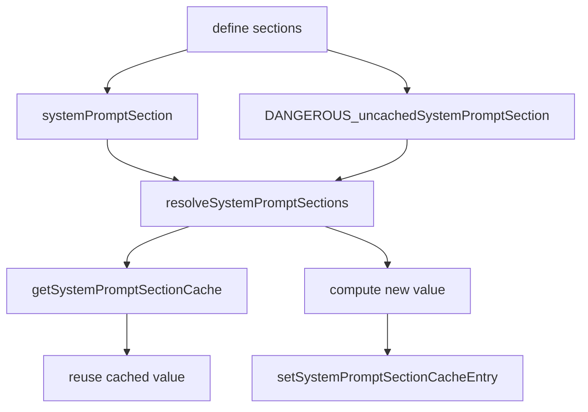

# System Prompt Sections

这一页只讲一件事：**Claude Code 不是简单拼几段字符串，而是在维护一套带缓存语义的 prompt section 结构。**

## 关键文件

- `restored-src/src/constants/systemPromptSections.ts`
- `restored-src/src/constants/prompts.ts`

## section 机制本身很简单，但很关键

`restored-src/src/constants/systemPromptSections.ts` 里一共给了三组核心能力：

- `systemPromptSection(name, compute)`
  - 生成一个可缓存 section
- `DANGEROUS_uncachedSystemPromptSection(name, compute, reason)`
  - 生成一个每轮都可能重新计算的 section
- `resolveSystemPromptSections(sections)`
  - 真正把 section 展开成 prompt 字符串数组

这里最关键的是 `cacheBreak` 这个概念：

- `systemPromptSection()` 的 `cacheBreak` 是 `false`
- `DANGEROUS_uncachedSystemPromptSection()` 的 `cacheBreak` 是 `true`

也就是说，源码里明确区分了：

- 可以在 `/clear` 或 `/compact` 之前复用的 section
- 会打破 prompt cache 的 volatile section

## 一张图看 section 解析

## 当前公开镜像里有哪些 dynamic sections

从 `restored-src/src/constants/prompts.ts` 可以直接看到，普通路径下会注册这些 dynamic sections：

- `session_guidance`
- `memory`
- `ant_model_override`
- `env_info_simple`
- `language`
- `output_style`
- `mcp_instructions`
- `scratchpad`
- `frc`
- `summarize_tool_results`
- `numeric_length_anchors`
- `token_budget`
- `brief`

其中最值得单独注意的是：

- `mcp_instructions`
  - 走的是 `DANGEROUS_uncachedSystemPromptSection()`
  - 原因也在源码里写得很清楚：MCP server 可能在不同 turn 之间连接或断开

这说明 section 不是“拆着写更好看”，而是为了给 prompt cache 和动态注入服务。

## `/clear` 和 `/compact` 会清掉什么

`restored-src/src/constants/systemPromptSections.ts` 里的 `clearSystemPromptSections()` 会：

- `clearSystemPromptSectionState()`
- `clearBetaHeaderLatches()`

而源码注释也写明了，它会在：

- `/clear`
- `/compact`

这些流程里调用。

这点很重要，因为它说明 compact 不是只处理消息历史，也会重置 prompt section 的缓存状态。

## 为什么 section 机制重要

这套机制带来几个很实际的效果：

- 不是每轮都要把所有 prompt 部分重新计算一遍
- 真正动态的部分可以被单独标记出来
- prompt cache 的边界更容易稳定
- compact / clear 之后，系统可以明确知道哪些 section 需要重建

从工程上说，这让 prompt 装配更像一个可维护的 registry，而不是散落在各处的字符串拼接。

## 已确认的事实

- section 在源码里是一等结构，不是抽象说法
- cache break 在类型层面就是显式字段
- `resolveSystemPromptSections()` 会先查 cache，再决定是否重新计算
- `/clear` 和 `/compact` 会清 prompt section state
- `mcp_instructions` 是明确的 uncached section

## 仍待确认

- 某些实验 gate 下是否还会动态增减 section 集合
- 不同构建形态下 beta header latch 的完整影响范围

这些点目前更适合保守记录，不适合扩写成完整结论。
