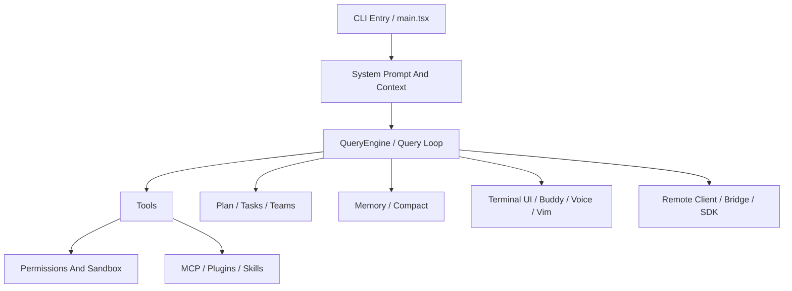

# Claude Code Source Deep Dive

> 一个专门拆解 `Claude Code` 源码结构、运行机制和设计思路的研究仓库。  
> 源码事实以 [`ChinaSiro/claude-code-sourcemap`](https://github.com/ChinaSiro/claude-code-sourcemap) 为唯一标准。

> 如果说有的参考仓库更像“Claude 为 Claude 写分析”，
> 这里更接近：**Codex 为 Claude 写分析**。

## Warning

This repository is unofficial and is intended for source-level research only. It does not represent Anthropic's internal repository layout or release position.

本仓库为非官方研究仓库，只做源码结构与运行机制整理，不代表官方内部仓库结构或发布口径。完整边界说明见 [DISCLAIMER.md](./DISCLAIMER.md)。

## 这个仓库要解决什么问题

很多人知道 Claude Code 很强，但不容易快速回答下面这些问题：

- 它的主循环是怎么组织的？
- `Plan Mode` 到底只是提示词，还是运行时状态？
- memory 为什么不只是一个 `CLAUDE.md`？
- team / sub-agent 为什么看起来比普通 fan-out 更完整？
- MCP、skills、plugins 这几层分别负责什么？
- permission、sandbox、approval 是怎么串起来的？

这个仓库的目标，就是把这些问题讲清楚，而且尽量讲得好读。

更具体一点说，这个仓库想做的是：

- 用更像文档站的方式整理源码阅读结果
- 把结论尽量挂回具体源码路径
- 把“已确认事实”和“仍待确认”明确分开
- 保持重心在源码架构、运行逻辑、实现细节，而不是营销式比较

## 阅读方式

- 想先建立整体印象：看 [ARCHITECTURE.md](./ARCHITECTURE.md)
- 想 5 分钟快速理解：看 [SIMPLE](./SIMPLE/)
- 想按系统拆开读：看 [MODULES](./MODULES/)
- 想给别的 Agent 直接喂结构化资料：看 [AI-AGENT](./AI-AGENT/)
- 想看 prompt 机制：看 [PROMPTS](./PROMPTS/)
- 想看被 gate / 隐藏 / 未必正式发布的能力：看 [FEATURE-FLAGS](./FEATURE-FLAGS/)
- 想补一点发布时间和竞品背景：看 [COMPARISONS](./COMPARISONS/)

## 推荐阅读路线

### 路线 A：先建立整体地图

1. [ARCHITECTURE.md](./ARCHITECTURE.md)
2. [MODULES/README.md](./MODULES/README.md)
3. 任选一个你最关心的模块进入 `SIMPLE/` 或 `DEEP/`

### 路线 B：想追主执行链

1. [ARCHITECTURE.md](./ARCHITECTURE.md)
2. [MODULES/01-agent-loop-and-teams](./MODULES/01-agent-loop-and-teams/)
3. [MODULES/02-planning-compaction-and-assistant](./MODULES/02-planning-compaction-and-assistant/)
4. [MODULES/03-persistent-memory-system](./MODULES/03-persistent-memory-system/)
5. [MODULES/05-tools-mcp-skills-and-plugins](./MODULES/05-tools-mcp-skills-and-plugins/)

### 路线 C：想追 prompt 与隐藏分支

1. [PROMPTS/README.md](./PROMPTS/README.md)
2. [FEATURE-FLAGS/README.md](./FEATURE-FLAGS/README.md)
3. [MODULES/08-prompts-config-and-other-moats](./MODULES/08-prompts-config-and-other-moats/)

最近已重点补厚的入口：

- [MODULES/05-tools-mcp-skills-and-plugins/DEEP/README.md](./MODULES/05-tools-mcp-skills-and-plugins/DEEP/README.md)：tool contract、MCP 动态实例化、skills / plugins 边界
- [MODULES/01-agent-loop-and-teams/DEEP/README.md](./MODULES/01-agent-loop-and-teams/DEEP/README.md)：`AgentTool` 编排层、`runAgent` 执行链、fork 与 task 表示层
- [MODULES/03-persistent-memory-system/DEEP/README.md](./MODULES/03-persistent-memory-system/DEEP/README.md)：`SessionMemory`、turn-end durable memory、team subtree 与 recall 调用边界
- [MODULES/02-planning-compaction-and-assistant/DEEP/README.md](./MODULES/02-planning-compaction-and-assistant/DEEP/README.md)：多路径 compact、plan 文件恢复链，以及 Todo / Task / runtime task 分层
- [MODULES/04-buddy-voice-vim-and-terminal-ui/DEEP/README.md](./MODULES/04-buddy-voice-vim-and-terminal-ui/DEEP/README.md)：companion、vim 输入内核、voice 判定与输入集成
- [MODULES/07-remote-session-bridge-and-sdk/DEEP/README.md](./MODULES/07-remote-session-bridge-and-sdk/DEEP/README.md)：`remote/` 会话客户端层与 `bridge/` 本地桥接层的分界
- [MODULES/08-prompts-config-and-other-moats/DEEP/README.md](./MODULES/08-prompts-config-and-other-moats/DEEP/README.md)：prompt 装配链、dynamic boundary、`REPL.tsx` / headless / subagent 差异
- [PROMPTS/agent-prompts.md](./PROMPTS/agent-prompts.md)：agent prompt 继承与 fork 差异
- [PROMPTS/skills-and-command-injection.md](./PROMPTS/skills-and-command-injection.md)：skill 从 `SKILL.md` 进入命令层与模型上下文的路径
- [FEATURE-FLAGS/README.md](./FEATURE-FLAGS/README.md)：按主题整理 `feature(...)`、GrowthBook、env flag 与隐藏分支

## 仓库结构

```text
.
├── README.md
├── DISCLAIMER.md
├── ARCHITECTURE.md
├── SIMPLE/
├── DEEP/
├── AI-AGENT/
├── MODULES/
├── COMPARISONS/
├── PROMPTS/
├── FEATURE-FLAGS/
├── EXAMPLES/
└── ASSETS/
```

## 先看总图



## 模块导航

### 01 Agent Loop And Teams
- 这部分解释 Claude Code 怎么管理主线程、worker、task list 和 teammate。
- 入口：[`MODULES/01-agent-loop-and-teams`](./MODULES/01-agent-loop-and-teams/)

### 02 Planning, Compaction, And Assistant
- 这部分解释多路径 compact、plan 文件恢复链，以及 Todo / Task / runtime task 的源码分层。
- 入口：[`MODULES/02-planning-compaction-and-assistant`](./MODULES/02-planning-compaction-and-assistant/)

### 03 Persistent Memory System
- 这部分是核心模块，讲 `SessionMemory`、turn-end durable memory、team subtree 和相关 recall 在源码里的真实边界。
- 入口：[`MODULES/03-persistent-memory-system`](./MODULES/03-persistent-memory-system/)

### 04 Buddy, Voice, Vim, And Terminal UI
- 这部分关注 companion 子系统、vim 输入状态机、voice mode gating 和终端交互层。
- 入口：[`MODULES/04-buddy-voice-vim-and-terminal-ui`](./MODULES/04-buddy-voice-vim-and-terminal-ui/)

### 05 Tools, MCP, Skills, And Plugins
- 这部分关注 Claude Code 如何把本地工具、MCP server、skills 和 plugins 组合成一个扩展面。
- 入口：[`MODULES/05-tools-mcp-skills-and-plugins`](./MODULES/05-tools-mcp-skills-and-plugins/)

### 06 Permissions, Sandbox, And Trust
- 这部分关注 permission rule、审批 UI、自动模式和危险命令分类。
- 入口：[`MODULES/06-permissions-sandbox-and-trust`](./MODULES/06-permissions-sandbox-and-trust/)

### 07 Remote Session, Bridge, And SDK
- 这部分关注远端 session 客户端、REPL / standalone bridge 路径，以及 `print.ts` 这类 SDK 接线对象。
- 入口：[`MODULES/07-remote-session-bridge-and-sdk`](./MODULES/07-remote-session-bridge-and-sdk/)

### 08 Prompts, Config, And Other Moats
- 这部分关注 prompt section、dynamic boundary、main-thread / subagent prompt 装配，以及一些不容易放进前面模块的关键设计。
- 入口：[`MODULES/08-prompts-config-and-other-moats`](./MODULES/08-prompts-config-and-other-moats/)

## 为什么很多人会研究 Claude Code

这个仓库不会把重点放在“谁打赢了谁”的营销式比较上，但有几个背景值得知道：

- 它不是只做补全，而是更接近一个可以自己推进任务的 `agentic coding tool`
- 它把 `Plan Mode`、team、memory、skills、MCP、permission 这些能力放进了同一套运行时
- 这些能力在源码里也会彼此连接，而不是完全独立的 feature

这些背景放在 [COMPARISONS](./COMPARISONS/) 中做轻量补充。

## 使用说明

- 先看 [ARCHITECTURE.md](./ARCHITECTURE.md)
- 再挑一个你最关心的模块进入 `SIMPLE` 或 `DEEP`
- 如果你是 AI Agent，优先读 [`AI-AGENT/repo-map.json`](./AI-AGENT/repo-map.json) 和对应模块下的 `agent-readme.txt`
- 如果你准备引用这里的结论，先看 [DISCLAIMER.md](./DISCLAIMER.md)

## 声明

- 这里的源码分析对象是公开镜像仓库 `ChinaSiro/claude-code-sourcemap`
- 这里只做技术研究与文档整理
- `PROMPTS/` 只解释机制，不会复制大段原始 prompt 文本
- feature gate / hidden branch 只按源码证据写，不等于公开发布状态
