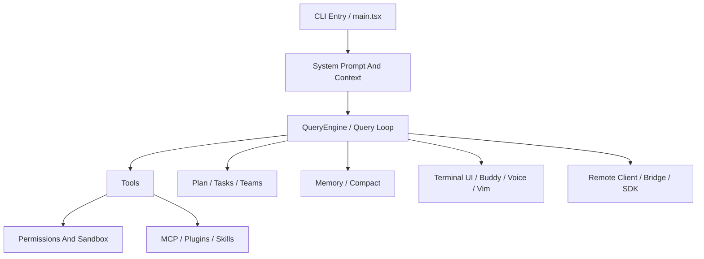

<div align="center">
  <h1>Claude Code Source Deep Dive</h1>
  <p><strong>一个专门拆解 <code>Claude Code</code> 源码结构、运行机制和实现边界的研究仓库。</strong></p>
  <p>尽量把每个重要判断挂回源码路径，把“已经确认”和“仍待确认”分开写清楚。</p>
  <p>
    <a href="./ARCHITECTURE.md">整体总览</a> ·
    <a href="./MODULES/README.md">模块导航</a> ·
    <a href="./PROMPTS/README.md">Prompt 机制</a> ·
    <a href="./FEATURE-FLAGS/README.md">Feature Flags</a> ·
    <a href="./DISCLAIMER.md">免责声明</a>
  </p>
  <p>
    
    
    
  </p>
</div>

> 本仓库是一个面向开发者的非官方研究仓库。<br>
> 源码相关事实以 [`ChinaSiro/claude-code-sourcemap`](https://github.com/ChinaSiro/claude-code-sourcemap) 与本地镜像 `_upstream/claude-code-sourcemap/` 为边界，不代表 Anthropic 官方内部仓库结构或发布口径。完整边界说明见 [DISCLAIMER.md](./DISCLAIMER.md)。

---

## Codex 眼中的 Claude Code

这份仓库可以看成是 **Codex 写给开发者的 Claude Code 源码分析**。

如果从 `Codex` 的角度看 `Claude Code`，最显眼的并不是某一个单点功能，而是它把很多原本容易分散的能力接成了一条持续运行的链：

- 一边是 prompt、tools、permissions、memory、tasks 这些运行时部件
- 另一边是 MCP、skills、plugins、remote/bridge 这些扩展面
- 中间再用 `query.ts`、compact、attachment、resume 把长会话维持起来

所以这份仓库的写法会有一个很明确的偏好：

- 少一点“它很强”的空话
- 多一点“这条链是怎么接起来的”
- 尽量把复杂机制写成开发者能顺着读下去的文档

---

## 如果你第一次来

| 你现在最想看什么 | 建议入口 | 会得到什么 |
| --- | --- | --- |
| 先建立整体地图 | [ARCHITECTURE.md](./ARCHITECTURE.md) | 主执行链、核心分层、模块之间怎么接起来 |
| 按系统逐块细读 | [MODULES/README.md](./MODULES/README.md) | 8 个模块的 `SIMPLE` / `DEEP` 阅读入口 |
| 只看 prompt / agent / skill 注入 | [PROMPTS/README.md](./PROMPTS/README.md) | prompt section、agent prompt、skill 注入路径 |
| 只看被 gate 的隐藏分支 | [FEATURE-FLAGS/README.md](./FEATURE-FLAGS/README.md) | `feature(...)`、GrowthBook、env flag 的专题整理 |
| 想让 AI 先读结构化资料 | [AI-AGENT](./AI-AGENT/) | repo map、reading order、模块摘要 |

## 这个仓库在解决什么问题

很多人知道 Claude Code 很强，但不容易快速回答下面这些更具体的问题：

- 它的主循环到底是怎么组织的？
- `Plan Mode` 是提示词行为，还是运行时状态切换？
- memory 为什么不只是一个 `CLAUDE.md`？
- team / sub-agent 为什么看起来比普通 fan-out 更完整？
- MCP、skills、plugins 到底各管哪一层？
- permission、sandbox、approval 是怎么串起来的？

这个仓库想做的，就是把这些问题拆开讲清楚，而且尽量讲得好读、可复核、方便继续追源码。

## 你会在这里看到什么

| 主题 | 你会看到的内容 |
| --- | --- |
| 主执行链 | `main.tsx -> REPL.tsx / QueryEngine.ts -> query.ts` 的连接方式 |
| 工具体系 | built-in tools、MCP、skills、plugins 的组合与边界 |
| 长会话能力 | memory、compact、Task / Todo / Plan Mode 的分层关系 |
| Prompt 装配 | 主线程、普通 subagent、fork subagent 的装配差异 |
| Hidden Branch | `KAIROS`、`PROACTIVE`、`voice`、`bridge`、`CHICAGO_MCP` 等 gated path |

## 阅读方式

| 场景 | 去哪里 |
| --- | --- |
| 想 5 分钟快速理解 | [SIMPLE](./SIMPLE/) |
| 想按系统拆开读 | [MODULES](./MODULES/) |
| 想直接看 prompt 机制 | [PROMPTS](./PROMPTS/) |
| 想看隐藏能力与 feature gate | [FEATURE-FLAGS](./FEATURE-FLAGS/) |
| 想补一点发布时间和轻量比较背景 | [COMPARISONS](./COMPARISONS/) |
| 想给别的 Agent 直接喂结构化资料 | [AI-AGENT](./AI-AGENT/) |

---

## 推荐阅读路线

| 路线 | 适合谁 | 推荐顺序 |
| --- | --- | --- |
| 路线 A：整体地图 | 第一次进入仓库 | [ARCHITECTURE.md](./ARCHITECTURE.md) -> [MODULES/README.md](./MODULES/README.md) -> 任意模块 `SIMPLE/` 或 `DEEP/` |
| 路线 B：主执行链 | 想先追核心运行时 | [ARCHITECTURE.md](./ARCHITECTURE.md) -> [MODULES/01-agent-loop-and-teams](./MODULES/01-agent-loop-and-teams/) -> [MODULES/02-planning-compaction-and-assistant](./MODULES/02-planning-compaction-and-assistant/) -> [MODULES/03-persistent-memory-system](./MODULES/03-persistent-memory-system/) -> [MODULES/05-tools-mcp-skills-and-plugins](./MODULES/05-tools-mcp-skills-and-plugins/) |
| 路线 C：Prompt 与隐藏分支 | 想先看装配机制和 gated branch | [PROMPTS/README.md](./PROMPTS/README.md) -> [FEATURE-FLAGS/README.md](./FEATURE-FLAGS/README.md) -> [MODULES/08-prompts-config-and-other-moats](./MODULES/08-prompts-config-and-other-moats/) |

## 精选入口

| 文档 | 重点 |
| --- | --- |
| [MODULES/05-tools-mcp-skills-and-plugins/DEEP/README.md](./MODULES/05-tools-mcp-skills-and-plugins/DEEP/README.md) | tool contract、MCP 动态实例化、skills / plugins 边界 |
| [MODULES/01-agent-loop-and-teams/DEEP/README.md](./MODULES/01-agent-loop-and-teams/DEEP/README.md) | `AgentTool` 编排层、`runAgent` 执行链、fork 与 task 表示层 |
| [MODULES/03-persistent-memory-system/DEEP/README.md](./MODULES/03-persistent-memory-system/DEEP/README.md) | `SessionMemory`、turn-end durable memory、team subtree 与 recall 调用边界 |
| [MODULES/02-planning-compaction-and-assistant/DEEP/README.md](./MODULES/02-planning-compaction-and-assistant/DEEP/README.md) | 多路径 compact、plan 文件恢复链，以及 Todo / Task / runtime task 分层 |
| [MODULES/04-buddy-voice-vim-and-terminal-ui/DEEP/README.md](./MODULES/04-buddy-voice-vim-and-terminal-ui/DEEP/README.md) | companion、vim 输入内核、voice 判定与输入集成 |
| [MODULES/07-remote-session-bridge-and-sdk/DEEP/README.md](./MODULES/07-remote-session-bridge-and-sdk/DEEP/README.md) | `remote/` 会话客户端层与 `bridge/` 本地桥接层的分界 |
| [MODULES/08-prompts-config-and-other-moats/DEEP/README.md](./MODULES/08-prompts-config-and-other-moats/DEEP/README.md) | prompt 装配链、dynamic boundary、`REPL.tsx` / headless / subagent 差异 |
| [PROMPTS/agent-prompts.md](./PROMPTS/agent-prompts.md) | agent prompt 继承与 fork 差异 |
| [PROMPTS/skills-and-command-injection.md](./PROMPTS/skills-and-command-injection.md) | skill 从 `SKILL.md` 进入命令层与模型上下文的路径 |
| [FEATURE-FLAGS/README.md](./FEATURE-FLAGS/README.md) | 按主题整理 `feature(...)`、GrowthBook、env flag 与隐藏分支 |

---

## 仓库结构

```text
.
├── README.md
├── DISCLAIMER.md
├── ARCHITECTURE.md
├── SIMPLE/
├── DEEP/
├── AI-AGENT/
├── MODULES/
├── COMPARISONS/
├── PROMPTS/
├── FEATURE-FLAGS/
├── EXAMPLES/
└── ASSETS/
```

## 先看总图



## 模块导航

| 模块 | 重点 | 入口 |
| --- | --- | --- |
| 01 Agent Loop And Teams | 主线程、worker、task list、teammate 编排 | [MODULES/01-agent-loop-and-teams](./MODULES/01-agent-loop-and-teams/) |
| 02 Planning, Compaction, And Assistant | 多路径 compact、plan 文件恢复链、Todo / Task / runtime task 分层 | [MODULES/02-planning-compaction-and-assistant](./MODULES/02-planning-compaction-and-assistant/) |
| 03 Persistent Memory System | `SessionMemory`、turn-end durable memory、team subtree 与 recall 边界 | [MODULES/03-persistent-memory-system](./MODULES/03-persistent-memory-system/) |
| 04 Buddy, Voice, Vim, And Terminal UI | companion、vim 输入状态机、voice mode gating 与终端交互 | [MODULES/04-buddy-voice-vim-and-terminal-ui](./MODULES/04-buddy-voice-vim-and-terminal-ui/) |
| 05 Tools, MCP, Skills, And Plugins | 本地工具、MCP、skills、plugins 的组合方式 | [MODULES/05-tools-mcp-skills-and-plugins](./MODULES/05-tools-mcp-skills-and-plugins/) |
| 06 Permissions, Sandbox, And Trust | permission rule、审批 UI、自动模式、危险命令分类 | [MODULES/06-permissions-sandbox-and-trust](./MODULES/06-permissions-sandbox-and-trust/) |
| 07 Remote Session, Bridge, And SDK | 远端 session 客户端、REPL / standalone bridge、SDK 接线边界 | [MODULES/07-remote-session-bridge-and-sdk](./MODULES/07-remote-session-bridge-and-sdk/) |
| 08 Prompts, Config, And Other Moats | prompt section、dynamic boundary、主线程 / subagent prompt 装配 | [MODULES/08-prompts-config-and-other-moats](./MODULES/08-prompts-config-and-other-moats/) |

---

## 为什么很多人会研究 Claude Code

这个仓库不会把重点放在“谁打赢了谁”的营销式比较上，但有几个背景值得知道：

- 它不是只做补全，而是更接近一个可以自己推进任务的 `agentic coding tool`
- 它把 `Plan Mode`、team、memory、skills、MCP、permission 这些能力放进了同一套运行时
- 这些能力在源码里也会彼此连接，而不是完全独立的 feature

这些背景放在 [COMPARISONS](./COMPARISONS/) 中做轻量补充；这里的主线仍然是源码结构和运行机制。

## 使用说明

- 先看 [ARCHITECTURE.md](./ARCHITECTURE.md)
- 再挑一个你最关心的模块进入 `SIMPLE` 或 `DEEP`
- 如果你是 AI Agent，优先读 [`AI-AGENT/repo-map.json`](./AI-AGENT/repo-map.json) 和对应模块下的 `agent-readme.txt`
- 如果你准备引用这里的结论，先看 [DISCLAIMER.md](./DISCLAIMER.md)

---

## 声明

- 这里的源码分析对象是公开镜像仓库 `ChinaSiro/claude-code-sourcemap`
- 这里只做技术研究与文档整理
- `PROMPTS/` 只解释机制，不会复制大段原始 prompt 文本
- feature gate / hidden branch 只按源码证据写，不等于公开发布状态
